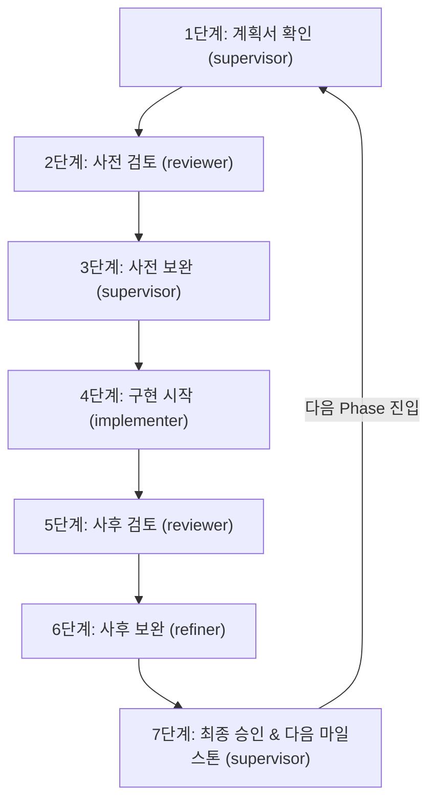

<!-- TALKLITE_MULTI_AGENT_WORKFLOW_START -->
# Talklite 프로젝트 멀티 에이전트 마일스톤 개발 업무 지침 (Project Rules)

> **적용 범위**: Talklite 프로젝트 전체 (`C:\Users\kimmh\VibeCoding\project\Talklite`)  
> **참조 원본 문서**: [`docs/멀티-에이전트-마일스톤-개발-업무지침서.md`](file:///C:/Users/kimmh/VibeCoding/project/Talklite/docs/멀티-에이전트-마일스톤-개발-업무지침서.md)  
> **적용 환경**: Herdr 4-Pane 멀티 에이전트 협업 환경 (`HERDR_ENV=1`)  

---

## 👥 1. Herdr 4-Pane 에이전트 전담 역할 정의

| Pane Label | Pane ID | Agent Kind | 지정 모델 (Designated Model) | 담당 역할 | 핵심 책무 (Core Responsibilities) |
| :--- | :---: | :---: | :---: | :---: | :--- |
| **`supervisor`** | `w1J:p4` | `agy` | — | **👑 총괄 감독<br>(Supervisor)** | • 전체 마일스톤 개발 라이프사이클 조율 및 단계별 품질 게이트 승인<br>• `implementer`, `reviewer`, `refiner`에게 명확한 태스크 지시 및 의사결정<br>• 백엔드 전체 회귀 테스트(`mvn test`) 및 프론트 빌드/린트 무결성 최종 검증<br>• **`docs/Phase-X-완료보고서.md` 간략 완료 보고서 작성**<br>• 위키, 인수인계서, CodeGraph, QMD, Git 원격 푸시 최종 동기화 총괄 |
| **`implementer`** | `w1J:p1` | `opencode` | **camelStream Auto**<br>(Provider: `camelStream`) | **🛠️ 메인 구현<br>(Implementer)** | • 위키 실행 계획서 및 핵심설계 해석본에 기반한 코어 코드(백/프론트) 본 구현<br>• 핵심 클래스/컴포넌트/스토어 신설 및 1차 기능 완결<br>• 단위 린트 및 빌드 검증 (`npm run lint`, `npm run build`, `mvn test-compile`) 1차 완료 후 핸드오프 |
| **`reviewer`** | `w1J:p3` | `opencode` | **Muse Spark 1.2 Contributor**<br>(Provider: `OpenCode Go`) | **🔍 코드 검토<br>(Reviewer)** | • **[검토 전담] 직접 코드를 수정하지 않고 오직 정밀 검토/분석 및 보고서 문서 작성만 수행**<br>• 사전 설계 및 사후 diff 심층 분석 결과를 **`docs/Phase-X-사전검토보고서.md`** 및 **`docs/Phase-X-사후검토보고서.md`** 파일로 직접 작성하여 보존<br>• 리소스 수명주기 관리 및 메모리 누수 방어 여부 검토 (Node disconnect, Event listener 해제 등)<br>• 에러 핸들링, 비정상 단절 처리, 접근성(a11y), 엣지 케이스 도출 및 체크리스트 작성 |
| **`refiner`** | `w1J:p5` | `opencode` | **Muse Spark 1.2 Contributor**<br>(Provider: `OpenCode Go`) | **✨ 보완 작업<br>(Refiner)** | • **[보완 전담] `reviewer`가 작성한 검토 보고서 파일(`docs/Phase-X-사후검토보고서.md`)을 직접 정독하고 실제 코드 수정 및 보완 작업만 전담 수행 (간략화된 프롬프트 전달 지양)**<br>• 브라우저 크로스 플랫폼(Chrome, Safari/WebKit, Firefox) 및 WebRTC/실시간 네트워크 호환성 검증 및 반영<br>• 핫스왑/디바운스/가드 최적화 및 엣지 케이스 방어 가드 코드 적용<br>• 린트 0 error 및 빌드 무결성 유지 상태로 감독(`supervisor`)에게 인계 |

---

## 🔄 2. 마일스톤 표준 7단계 개발 사이클 (Standard Lifecycle)

모든 마일스톤 개발은 단계를 건너뛰지 않고 아래 **7단계 순환 프로세스**를 엄격히 준수하여 순차 진행합니다.



### 📌 Step 1: 계획서 확인 (Plan Verification)
* **주관**: `supervisor` (총괄 감독, `w1J:p4`)
* **수행 내용**:
  1. 위키 내 해당 Phase 실행 계획서 (`Talklite-Phase-X-실행계획.md`) 및 `docs/Phase-X-핵심설계-해석본.md` 정독
  2. 선행 마일스톤과의 의존성 및 백엔드/프론트엔드 변경 영향도 파악
  3. 완료 정의(DoD) 및 테스트 요구사항 목록 확정

### 📌 Step 2: 사전 설계 검토 (Pre-Implementation Review)
* **주관**: `reviewer` (`w1J:p3`)  *(※ 리뷰어는 검토만 전담)*
* **수행 내용**:
  1. `supervisor`가 `reviewer`에게 실행 계획서 및 핵심설계 해석본에 대한 사전 설계 검토 요청
  2. 아키텍처 결함, 브라우저 API 제약사항, WebRTC/STOMP 충돌 가능성, 성능 병목 사전 도출
  3. **`docs/Phase-X-사전검토보고서.md`** 파일로 상세 분석 보고서 작성 및 저장 (코드 수정 일체 금지)

### 📌 Step 3: 사전 보완 (Pre-Implementation Refinement)
* **주관**: `supervisor` (총괄 감독, `w1J:p4`)
* **수행 내용**:
  1. 작성된 사전검토보고서(`docs/Phase-X-사전검토보고서.md`) 피드백을 수렴하여 위키 실행 계획서 및 핵심설계 해석본에 반영 최신화
  2. `implementer`가 구현 시 지켜야 할 명확한 기술 스펙 및 규칙 확정

### 📌 Step 4: 구현 시작 (Main Implementation)
* **주관**: `implementer` (메인 구현, `w1J:p1`)
* **수행 내용**:
  1. `supervisor`의 작업 지시에 따라 코어 비즈니스 로직, API, 컴포넌트, 상태 스토어 구현
  2. 로컬 린트 및 빌드 검증 수행 (`npm run lint`, `npm run build`, `mvn test-compile`)
  3. 변경 사항 목록 및 1차 구현 완료 보고서를 작성하여 `supervisor`에게 전달

### 📌 Step 5: 사후 검토 (Post-Implementation Review)
* **주관**: `reviewer` (코드 검토, `w1J:p3`)  *(※ 리뷰어는 검토만 전담)*
* **수행 내용**:
  1. `git diff`를 정밀 분석하여 코드 품질, 잠재적 버그, 리소스 해제 누락, UI 접근성 점검 (코드 수정 금지)
  2. 수정이 필요한 구체적인 항목(P0/P1/P2 Action Items)과 파일 위치, 라인 번호, 개선 가이드를 **`docs/Phase-X-사후검토보고서.md`** 파일로 직접 작성하여 저장

### 📌 Step 6: 사후 보완 (Post-Implementation Polish)
* **주관**: `refiner` (보완 작업, `w1J:p5`)  *(※ 리파이너는 보완 코드 작성 전담)*
* **수행 내용**:
  1. `supervisor`로부터 검토 보고서 파일 경로를 전달받아, **`docs/Phase-X-사후검토보고서.md` 문서를 직접 열람 및 정독**
  2. 보고서에 기술된 Action Items(P0/P1/P2)를 빠짐없이 실제 소스코드에 반영 (리팩토링, 엣지 케이스 가드 적용, 디바운스/핫스왑 최적화)
  3. 프론트엔드 린트 0 error 및 빌드 통과 재확인 후 `supervisor`에게 최종 인계

### 📌 Step 7: 최종 승인 및 다음 마일스톤 (Final Approval & Handoff)
* **주관**: `supervisor` (총괄 감독, `w1J:p4`)
* **수행 내용**:
  1. **품질 게이트 검증**:
     * 프론트엔드: `cd frontend; npm run lint && npm run build` (0 error)
     * 백엔드: `cd backend; .\mvnw.cmd test` (전체 회귀 테스트 ALL PASS)
  2. **마일스톤 완료 보고서 작성**:
     * **`docs/Phase-X-완료보고서.md` 작성**: 마일스톤 목표 및 달성 요약, 주요 구현 내용, 품질 검증 결과 표(린트/빌드/테스트/DoD) 간략 작성
  3. **지식 베이스 및 문서 동기화**:
     * `docs/인수인계서.md` 체크리스트 및 상태 갱신
     * `docs/Phase-X-핵심설계-해석본.md` 최종 최신화
     * 위키 실행 계획서 `status: completed` 🔵 전환 및 `log.md`, `마스터-Talklite.md` 갱신
     * `codegraph sync` 및 `qmd update; qmd embed` 지식 인덱싱
  4. **버전 관리**: Git 커밋 및 GitHub 원격 저장소 푸시 (`origin/main`)
  5. **다음 마일스톤 지시**: 사용자 보고 후 다음 Phase의 **Step 1**으로 즉시 진입

---

## 🖥️ 3. 상시 4-Pane Herdr 작업 환경 유지 및 복구 지침

1. **상시 4-Pane 역할별 라벨 유지 의무**:
   * `w1J:p4` (라벨: **`supervisor`**): 총괄 감독 (`agy`)
   * `w1J:p1` (라벨: **`implementer`**): 메인 구현 (`opencode`)
   * `w1J:p3` (라벨: **`reviewer`**): 코드 검토 (`opencode`)
   * `w1J:p5` (라벨: **`refiner`**): 보완 작업 (`opencode`)
2. **세션 시작 시 상태 검증 & 자동 라벨링 복구**:
   * 세션 시작 시 `herdr pane list`로 4개 Pane 라벨 확인 후 유실 시 즉시 복구:
     ```bash
     herdr pane rename w1J:p4 supervisor
     herdr pane rename w1J:p1 implementer
     herdr pane rename w1J:p3 reviewer
     herdr pane rename w1J:p5 refiner
     ```

---

## 🛠️ 4. Herdr 협업 운영 명령어 가이드

```bash
# 1. 4-Pane 에이전트 연결 상태 점검
herdr agent list
herdr pane list

# 2. 특정 역할 Pane에 태스크 지시 및 완료 대기 (--wait)
herdr agent prompt w1J:p1 "<implementer 작업 지시>" --wait --timeout 300000
herdr agent prompt w1J:p3 "<reviewer 검토 지시>" --wait --timeout 120000
herdr agent prompt w1J:p5 "<refiner 보완 지시>" --wait --timeout 120000

# 3. 에이전트의 작업 결과 및 보고서 읽기
herdr agent read <pane_id> --source recent-unwrapped --lines 200

# 4. 백그라운드 작업 완료 대기
herdr agent wait <pane_id> --timeout 120000
```
<!-- TALKLITE_MULTI_AGENT_WORKFLOW_END -->
