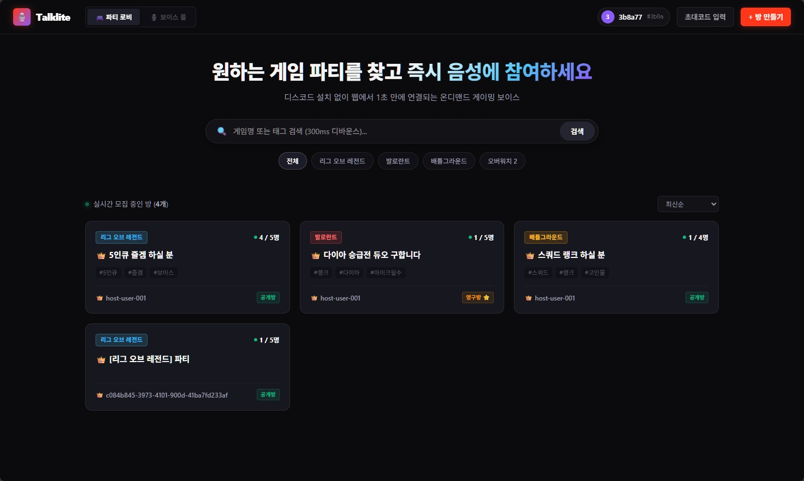
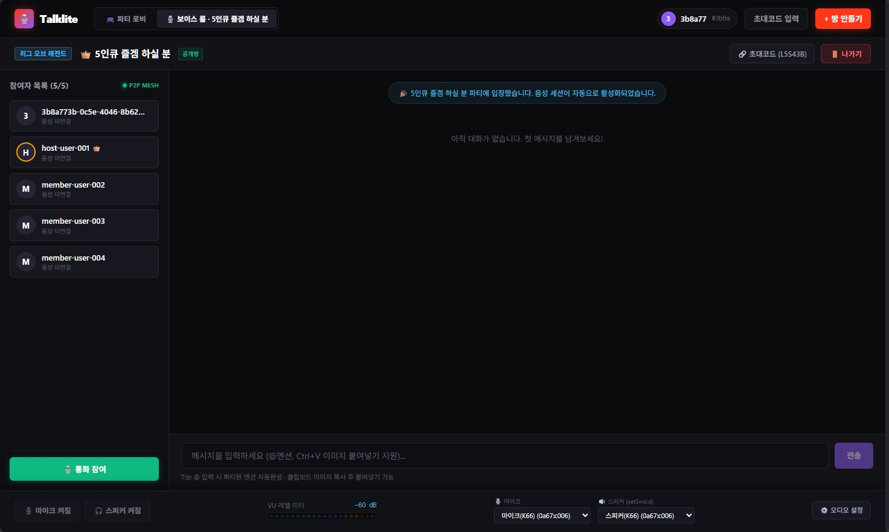
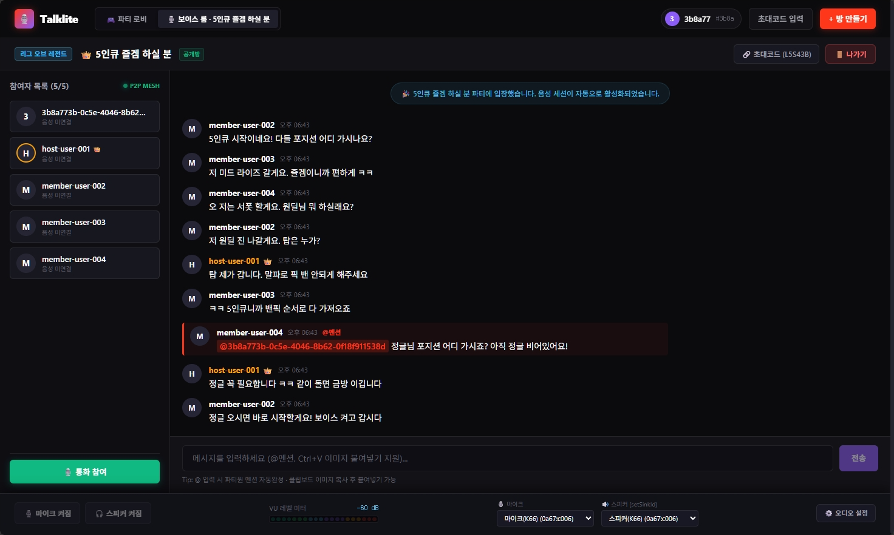
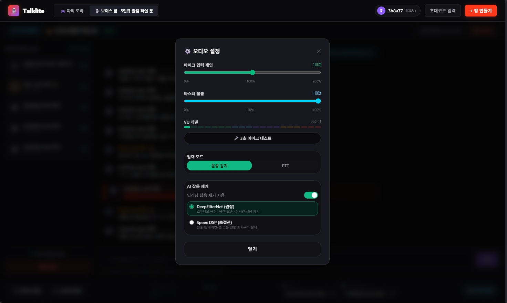
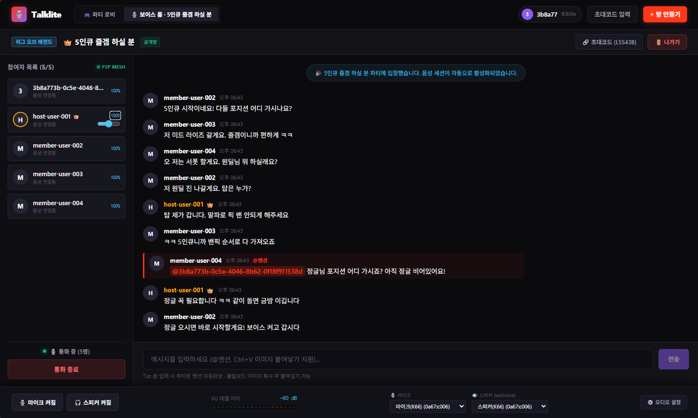
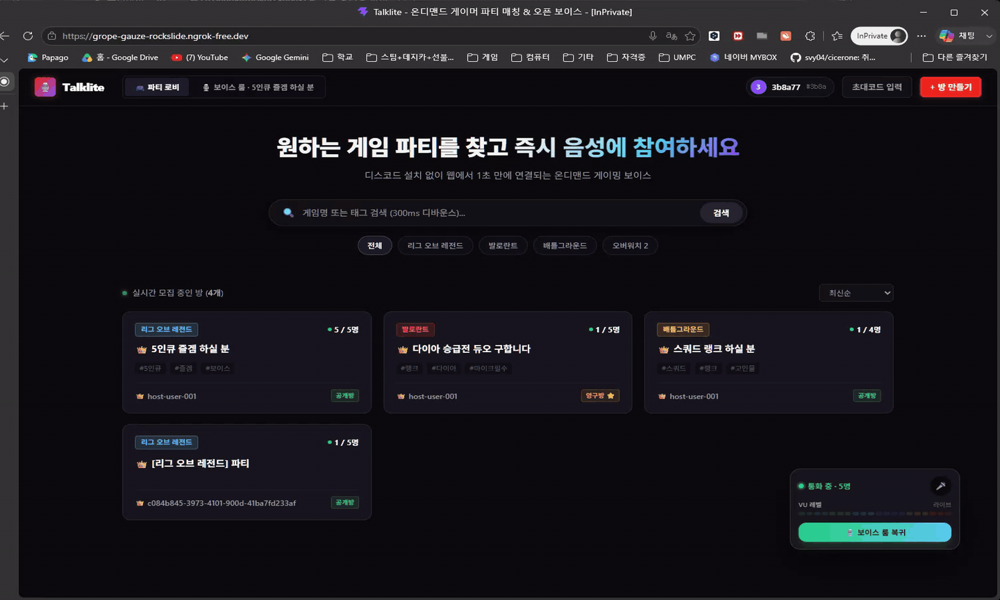

# 🎙️ Talklite — 온디맨드 게이머 파티 매칭 & 오픈 보이스 플랫폼

<div align="center">


</div>

## ⚡ TL;DR

> **회원가입도, 서버 가입도, 친구 추가도 없이** — 게임명과 커스텀 해시태그로 3초 만에 파티를 찾고 바로 음성 통화를 시작하는 온디맨드 보이스 플랫폼입니다.
>
> - Redis Lua 원자 연산으로 **500개 병렬 동시 입장에서 정원 초과 0건** 보장
> - WebRTC **P2P Mesh** 토폴로지로 **서버 미디어 릴레이 비용 0원** 그룹 보이스
> - 온디바이스 **AI 잡음 제거(DeepFilterNet/Speex)** + 정밀 오디오 파이프라인
> - **상주 세션 아키텍처** — 로비를 둘러봐도 통화가 끊기지 않고, 우하단 미니 위젯으로 복귀
> - 딥다크 **Taipy 스타일 Bento UI** — 목업(`UI_MockUp/`)과 1:1 일치

---

## 📌 Overview (프로젝트 개요)

게임을 하다 보면 "지금 당장 같이 할 사람"이 필요하지만, 기존 디스코드·커뮤니티 방식은 **서버 가입 → 채널 탐색 → 초대 대기**라는 마찰이 큽니다.

Talklite는 이 마찰을 제거한 **온디맨드(On-demand) 파티 매칭 & 오픈 보이스 플랫폼**입니다:

- **익명 UUID 기반 즉시 참여** — 회원가입 없이 브라우저만으로 파티 생성/입장, 커스텀 닉네임 설정
- **5종 게임 프리셋 & 해시태그 교집합 검색** — 인기 게임 원클릭 탭 + 300ms 디바운스 실시간 검색 + 3×2 복합 정렬
- **Opt-in 음성 통화** — 원할 때만 마이크를 켜는 1:N 그룹 보이스 (최대 6인), 로비에서도 통화 유지
- **정밀 오디오 엔진 & 고급 음성 UX** — 200% 증폭·피크 컴프레서, 20단계 VU 미터, PTT, 온디바이스 AI 잡음 제거, 독립 출력 장치(`setSinkId`)
- **인터랙티브 채팅 시스템** — 서버 확정 @멘션·무에셋 핑, 클립보드 WebP 이미지 업로드 & 라이트박스
- **동적 방 관리 & 이중 라이프사이클** — 방장 실시간 수정·원자 재색인, 일회성 파티 자동 소멸(GC), 영구 방 영속화

---

## 🖼️ Screenshots (스크린샷)

> 실제 서비스 화면 — 딥다크 Bento UI, 목업 1:1 일치

| 로비 (파티 매칭) | 보이스 룸 |
| :---: | :---: |
|  |  |

| 채팅 (멘션 & 이미지) | 오디오 설정 |
| :---: | :---: |
|  |  |

| 통화 중 (로비에서도 통화 유지) |
| :---: |
|  |

| 통화 중 플로팅 카드 (데모) |
| :---: |
|  |

> 💡 **통화 중 플로팅 카드** — 로비를 둘러봐도 우하단 미니 카드로 통화가 유지됩니다. 드래그로 위치 이동이 가능합니다.

---

## 🌟 Key Highlights (핵심 구현)

### 1️⃣ Atomic Room Operations (Lua 기반 원자적 동시성 제어)
정원 경쟁(Race Condition)은 분산 환경의 고전적 문제입니다. Talklite는 입장(`join.lua`)·음성 입장(`voice_join.lua`)·파괴 GC(`gc.lua`)·강제 삭제(`destroy.lua`)·방 수정 재색인(`update_room.lua`) 5종 Lua Script로 **조건 검사와 상태 변경을 Redis 단일 스레드 안에서 원자 처리**합니다.
→ 검증: 500개 병렬 Join 요청에서 정확히 정원 수만큼만 성공, 나머지 전부 409 반환 (`PerformanceLatencyIntegrationTest`)

### 2️⃣ Ultra-fast Search: SINTER 역색인 + 3×2 복합 정렬
- 태그·게임명을 Redis Set 역색인(`tag:{tag}:rooms`, `game:{game}:rooms`)으로 관리하고, 다중 조건 검색은 `SINTER` 교집합 한 번으로 해결합니다.
- 모든 키는 `trim().toLowerCase()` 정규화로 색인 일관성 보장 (한글 게임명 정식 명칭 단일 소스 — `lib/gamePresets.ts`).
- **3×2 복합 정렬**: `latest` / `title` / `members` × `asc` / `desc`, 기본값 `latest/desc`, 화이트리스트 검증(400), Null-Safe 대소문자 무시 사전순 + 조건부 2차 키.
- 방 수정 시 `update_room.lua`가 `oldGame`/`oldTags`를 원자적으로 `SREM`/`SADD` 재색인하여 검색 상태 실시간 동기화.

### 3️⃣ P2P Voice Mesh with Precision Audio Engine (서버 비용 0원)
- **WebRTC 1:N Mesh 토폴로지 (최대 6인)**: 미디어는 피어 간 직접 전송, 서버는 STOMP 시그널링 중계만 담당
- **Perfect Negotiation 패턴**: Google 공용 STUN으로 NAT/방화벽 통과 및 시그널링 충돌 방지
- **정밀 오디오 파이프라인 (`VoiceAudioEngine`)**:
  - `MediaStreamSource` → `GainNode`(200% 증폭) → `DynamicsCompressorNode`(피크 방어) → `AnalyserNode`
  - 참여자별 개별 볼륨(0~200%)·마스터 볼륨(0~100%), UID별 영구 기억, 장치 핫스왑
- **온디바이스 플러그형 잡음 제거**: DeepFilterNet / SpeexDSP 2종 정예 엔진, Web Audio 단일 가청 경로
- **독립 출력 장치 라우팅 (Phase 13)**: 입력/출력 완전 분리, `AudioContext.setSinkId()` 핫스왑, 물리 장치 1:1 단일 노출
- **고급 음성 UX & PTT**: 20단계 6그라디언트 VU, 3초 루프백 테스트, `event.code` PTT, 4중 Stuck Mute 방어

### 4️⃣ Persistent Session & Floating Voice Widget (상주 세션 아키텍처)
- `App.tsx` 최상위에서 `activeView: 'LOBBY' | 'ROOM'` 뷰 상태 호이스팅 — **로비 이동 중에도 WebRTC/STOMP 세션 무중단 유지**
- 통화 중 로비 둘러보기 시 우하단 **미니 플로팅 통화 카드**(`FloatingVoiceWidget`): 30fps VU, Mute 토글, 원클릭 룸 복귀
- 명시적 `[🚪 방 나가기]` 단일 3단계 Teardown(`leaveVoice → leaveRoom → setCurrentRoom(null)`)
- 보이스바는 통화 참여 여부와 무관하게 **상시 렌더링**, 참여자 사이드바 좌측 하단 통화 제어 카드 배치

### 5️⃣ Interactive Chat System (서버 확정 멘션 & 미디어 전송)
- **서버 확정 @멘션**: 정규식 기반 닉네임 파싱, Web Audio 무에셋 핑 사운드(880Hz → 1760Hz) 합성
- **안전한 이미지 업로드**: 5MB/MIME 검증(`POST /api/rooms/{id}/images`), 클립보드(`Ctrl+V`) WebP 자동 압축 업로드, 라이트박스 뷰어
- **고성능 렌더링**: TanStack Virtual 가상화 리스트, 동적 높이 재측정

### 6️⃣ Dynamic Room Management & Dual Lifecycle
- **동적 방 수정 (`PATCH /api/rooms/{id}`)**: 방장 권한(403)·정원 축소(409) 검증, `ROOM_UPDATED` 이중 STOMP 브로드캐스트
- **방 제목(`title`) 7계층 원자 계약**: `Room` → DTO → Repository → Mapper → Service → Search 전 계층 동기화, 미입력 시 `[게임명] 파티` 기본값
- **휘발성 방**: 마지막 인원 퇴장 즉시 Lua로 완전 파기 (Room GC)
- **영구 방**: MariaDB 영속화 + `RoomRehydrator` 복원, 방장 부재 시 고아 상태 → 첫 재입장자에게 `👑` 자동 승계
- **Self-Healing 인증**: 유령 토큰(Ghost Token) 자동 재발급, `@AuthenticatedUser`로 HTTP Bearer 인가 강제

---

## 🏗️ Architecture (아키텍처)

```
[ Frontend (React 19 + Vite 7) ]
   │
   ├─ REST API (/api/*) ───────▶ [ Spring Boot 3.5 Backend ]
   │  (Auth, Room, Search, Chat Image)│
   │                                  ├─▶ [ Redis 7 ] (Hash/Set/ZSet/Lua/PubSub - 인메모리 & 동시성)
   ├─ STOMP WebSocket (/ws) ──────────┤
   │  (Chat, Signaling, Room Sync)    └─▶ [ MariaDB 11 ] (영구 방 & 대화 기록 영속화)
   │
   └─ WebRTC P2P Mesh (Voice) ──▶ [ Peer ↔ Peer (Google STUN) ]
```

**Relay-Only 규약**: 모든 실시간 이벤트는 Redis Pub/Sub 채널로만 발행되고, STOMP 브로드캐스트는 `RedisMessageSubscriber`가 단독 수행합니다. 단일 경로 설계로 이중 발송/로컬 브로드캐스트 누수 버그를 구조적으로 차단했습니다.

---

## 🛠️ Tech Stack (기술 스택)

### Frontend
| 분야 | 기술 | 버전 | 설명 |
| :--- | :--- | :---: | :--- |
| **Framework** | React · TypeScript · Vite | 19.x / 5.x / 7.x | 반응형 SPA 프레임워크 & 빌드 |
| **State** | Zustand | 5.x | 전역 상태 (`roomStore`, `voiceStore`, `lobbyStore`, `userStore`, `toastStore`) |
| **Styling** | TailwindCSS 4 | 4.x | 딥다크 Bento 디자인 시스템 + 목업 CSS |
| **Virtualization** | TanStack Virtual | 3.x | 채팅 리스트 가상화 |
| **Realtime** | STOMP.js | 7.x | STOMP over WebSocket 싱글턴 |
| **Media & Audio** | WebRTC · Web Audio API | Browser Native | P2P Mesh 음성, 200% 증폭 & 컴프레서, VU 미터, AI 잡음 제거, `setSinkId` |

### Backend & Infra
| 분야 | 기술 | 버전 | 설명 |
| :--- | :--- | :---: | :--- |
| **Framework** | Spring Boot · Java (LTS) | 3.5.x / 21 | REST API & STOMP 메시지 브로커 |
| **Realtime** | Spring WebSocket (STOMP) · Spring Data Redis | Boot 3.5 | Relay-Only Pub/Sub 브로드캐스트 |
| **Store** | Redis | 7.x | SINTER 역색인, 5종 Lua 원자 스크립트, Pub/Sub |
| **Database** | MariaDB | 11.x | 영구 방 메타데이터 & 채팅 기록 영속화 |
| **Infra** | Docker Compose | Standard | Redis 7 & MariaDB 11 통합 컨테이너 |

---

## 💡 Technical Decisions (기술적 선택과 이유)

- **Realtime Store: Redis 7 (Hash/Set/ZSet + Lua)** — 방 메타는 Hash, 멤버는 Set, 체류시간은 ZSet, 검색은 Set 역색인으로 모델링. `SINTER`로 다중 태그 교집합을 O(N) 탐색 없이 처리하고, `join / voice_join / gc / destroy / update_room` 5종 Lua 스크립트로 애플리케이션 락 없이 500 병렬 요청에서도 정원 초과 0건 보장.
- **Realtime Transport: STOMP over WebSocket + Redis Pub/Sub Relay-Only** — Spring STOMP Simple Broker만으로는 멀티 인스턴스 브로드캐스트가 불가능해, 발행은 `RedisMessagePublisher` 단일 경로, 구독은 `RedisMessageSubscriber`가 STOMP로 중계하는 구조. 이중 발송/로컬 누수 버그를 아키텍처 레벨에서 차단.
- **Frontend State: Zustand vs Redux** — 보이스 세션(WebRTC Manager, AudioContext, VoiceAudioEngine)처럼 React 외부 라이프사이클을 갖는 객체를 전역 관리하기 위해 보일러플레이트가 적고 외부 스토어 구독이 자유로운 Zustand(5.x)를 선택.
- **Voice: WebRTC P2P Mesh + Web Audio Engine vs SFU** — 6인 이하 소규모 파티 타깃이라 서버 미디어 릴레이가 불필요한 Mesh가 비용·지연·구현 복잡도에서 유리. Perfect Negotiation으로 Offer/Answer 충돌 해결.
- **Persistent Session (vs 화면별 마운트)** — WebRTC/STOMP는 React 생명주기와 무관한 외부 리소스이므로 `App.tsx` 최상위에 호이스팅하고 뷰만 전환. 언마운트로 인한 음성 단절 회귀를 구조적으로 차단.
- **Persistence: MariaDB + Redis Hybrid** — 휘발성 방은 Redis에만 두고 GC로 즉시 파기, 영구 방·대화 기록만 MariaDB에 영속화해 서버 재기동 후 `RoomRehydrator`로 복원.

---

## 🧪 Test & Quality (테스트 및 품질)

Redis DB 격리 + 자동 Teardown 환경에서 **67개 통합 테스트 100% ALL PASS**, 프론트엔드 린트 0 error·빌드 무결성을 유지합니다.

```bash
# 백엔드 전체 회귀 테스트 (67/67 ALL PASS)
cd backend && .\mvnw.cmd test

# 프론트엔드 린트 & 빌드 (0 error)
cd frontend && npm run lint && npm run build
```

| 테스트 클래스 | 테스트 수 | 검증 대상 | 결과 |
| :--- | :---: | :--- | :---: |
| `DefectRemediationIntegrationTest` | 5 | 실전 결함 DEF-01~06 (인증 강제, 0명 승계, Presence 단절, 6인 Lua 가드, 태그 정규화) | ✅ PASS |
| `SignalRealtimeIntegrationTest` | 3 | WebRTC 시그널링 Offer/Answer/ICE 및 보이스 정원 6인 가드 | ✅ PASS |
| `HostMigrationIntegrationTest` | 1 | 방장 퇴장 시 ZSet 기준 최고참 방장 승계 | ✅ PASS |
| `InviteAndAuthIntegrationTest` | 4 | 비공개 방 초대코드 발급, STOMP CONNECT/SUBSCRIBE 보안 인가 | ✅ PASS |
| `KickApiIntegrationTest` | 4 | 방장 강퇴 (임시/영구 밴, 음성 퇴장 연동) | ✅ PASS |
| `RoomApiIntegrationTest` | 6 | 방 생성/입장/퇴장 REST + 정원 경계(7인·1인 거부) + title 기본값/truncate | ✅ PASS |
| `RoomConcurrencyIntegrationTest` | 1 | 50명 동시 입장 시 Lua 정원 원자 차단 | ✅ PASS |
| `RoomDeletionIntegrationTest` | 4 | 영구 방 삭제, 비방장 403, 부재 404, 다중 인원 폭파 소멸 | ✅ PASS |
| `RoomGcIntegrationTest` | 3 | 마지막 인원 퇴장 즉시 파기, 초대코드/역색인 SREM, 동시 입퇴장 2중 가드 | ✅ PASS |
| `PermanentRoomPersistenceIntegrationTest` | 2 | MariaDB 영속화, 방장 승계 DB 동기화, Re-hydration title 복원 | ✅ PASS |
| `ChatHistoryIntegrationTest` | 3 | 영구 방 대화 저장, 과거순 복원, Redis 캐시 미스 MariaDB 폴백, 방 삭제 시 대화 소멸 | ✅ PASS |
| `RoomUpdateIntegrationTest` | 4 | PATCH 수정, 비방장 403, 정원 축소 409, 태그 SREM/SADD 원자 재색인 | ✅ PASS |
| `ComprehensiveAuditIntegrationTest` | 10 | 종합 결함 전수 (인증 401/403, 정원 409, 원자 재색인, 멘션/이메일 오탐 방어) | ✅ PASS |
| `PerformanceLatencyIntegrationTest` | 1 | 500 병렬 원자 정원 가드 + 평균 지연 ≤ 200ms | ✅ PASS |
| `SearchApiIntegrationTest` | 14 | SINTER 검색, 3×2 복합 정렬, 대소문자 정규화, 위반 400, title null 혼합 | ✅ PASS |
| `ChatRealtimeIntegrationTest` | 2 | STOMP 채팅 실시간 브로드캐스트 및 clientRequestId 에코 | ✅ PASS |
| **합계** | **67** | **T-01~T-11 전체 시나리오, DEF-01~09, Phase 8~14 전수 검증** | **ALL PASS** |

---

## 🚀 Quick Start (실행 방법)

### 원클릭 실행 (Windows 추천)
```bash
.\start.bat   # Docker + Spring Boot + Vite 일괄 기동
.\stop.bat    # 전체 안전 종료
```

### 수동 실행
```bash
# 1) Docker 인프라 기동 (Redis 7 & MariaDB 11)
docker compose up -d

# 2) 백엔드 기동 (8080)
cd backend && .\mvnw.cmd spring-boot:run

# 3) 프론트엔드 기동 (5173)
cd frontend && npm install && npm run dev
```

- **웹 앱:** `http://localhost:5173` · **REST API:** `http://localhost:8080`

---

## 📂 Project Structure (프로젝트 구조)

```
Talklite/
├── backend/                             # Spring Boot 3.5 백엔드
│   └── src/main/java/com/talklite/
│       ├── auth/                        # 익명 세션 토큰 & @AuthenticatedUser 인가
│       ├── chat/                        # @멘션 파싱, 대화 영속화, 이미지 업로드
│       ├── config/                      # WebSocket STOMP, Redis Lua, Static Resource
│       ├── realtime/                    # Redis Pub/Sub Relay-Only 브로드캐스트
│       ├── room/                        # 방 도메인, title 계약, PATCH 수정, 영속화
│       ├── search/                      # SINTER 검색 + 3×2 복합 정렬 엔진
│       ├── signaling/                   # WebRTC 시그널링 (Offer/Answer/ICE)
│       └── voice/                       # 6인 음성 원자 가드 & 발화 상태
├── frontend/                            # React 19 + TypeScript + Vite
│   └── src/
│       ├── components/                  # Header, SearchBar, RoomCard, VoiceBar, FloatingVoiceWidget,
│       │                                # AudioSettingsModal, NicknameModal, ChatLog, MemberList, Toast 등
│       ├── lib/                         # webrtc, voiceAudioEngine, audioDetector, gamePresets, stomp, api
│       ├── store/                       # Zustand (roomStore, voiceStore, lobbyStore, userStore, toastStore)
│       └── pages/                       # LobbyPage, RoomPage
├── docs/                                # 업무지침서, 인수인계서, UI 레퍼런스 & 스크린샷
├── docker-compose.yml                   # Redis 7 & MariaDB 11 오케스트레이션
└── start.bat / stop.bat                 # 원클릭 기동/종료 스크립트
```

---

<div align="center">
  <sub>Solo-built with ❤️ — Talklite</sub>
</div>