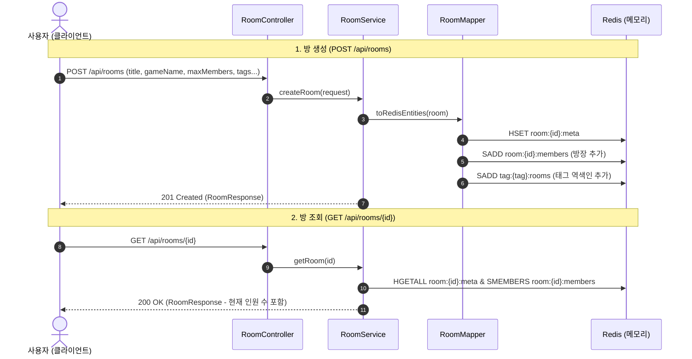

# 🏠 Talklite Phase 1 핵심 설계 해석본 및 용어 사전

> 작성일: 2026-08-24  
> 대상 문서: `Talklite-Phase-1-실행계획.md` (방 도메인 및 Redis 기본 연동)  
> 목적: Phase 1의 핵심 아키텍처 결정 사항, 데이터 모델링 원리, REST API 설계 및 주요 기술 용어 해설

---

## 📋 목차
1. [한눈에 보는 Phase 1 구조](#1-한눈에-보는-phase-1-구조)
2. [핵심 설계 결정 4가지 해설 (Why & How)](#2-핵심-설계-결정-4가지-해설-why--how)
3. [데이터 흐름 및 REST API 흐름도](#3-데이터-흐름-및-rest-api-흐름도)
4. [핵심 기술 용어 사전 (Glossary)](#4-핵심-기술-용어-사전-glossary)

---

## 1. 한눈에 보는 Phase 1 구조

### 💡 "Phase 1은 무엇을 만들었나요?"
Phase 1은 게이머가 파티 방을 **생성(Create)**, **조회(Get)**, **입장(Join)**, **퇴장(Leave)**할 수 있는 **기본 방 라이프사이클 REST API**와 **Redis 데이터 구조**를 구축한 단계입니다.

```
[클라이언트 (React)]
        │ (REST API: POST, GET)
        ▼
[Spring Boot (RoomController -> RoomService -> RoomMapper)]
        │
        ├──> Redis Hash (room:{id}:meta)   : 방 제목, 방장, 게임명, 정원 등
        ├──> Redis Set  (room:{id}:members): 현재 방에 있는 유저 UUID 목록
        └──> Redis Set  (tag:{name}:rooms) : 특정 태그가 붙은 방 ID 색인
```

---

## 2. 핵심 설계 결정 4가지 해설 (Why & How)

### ① RDB 대신 Redis 인메모리 기본 저장소 채택
* **배경:** 게임 파티 방은 생성 후 보통 수십 분~수 시간 내에 사라지는 **휘발성(Ephemeral)** 데이터입니다.
* **해결:** RDB의 무거운 트랜잭션과 디스크 I/O 대신, 초당 수만 건의 읽기/쓰기가 가능한 **Redis 인메모리**를 기본 저장소로 사용했습니다.
* **이점:** 밀리초(ms) 단위의 초고속 방 생성 및 멤버 입퇴장 처리.

### ② Redis 데이터 구조 분리 (Hash + Set)
* **배경:** 하나의 큰 JSON 문자열로 방 정보를 통째로 저장하면, 유저 한 명이 들어오거나 나갈 때마다 전체 JSON을 파싱하고 다시 직렬화해야 하므로 비효율적이고 동시성 충돌이 일어납니다.
* **해결:** 관심사에 따라 키를 분리했습니다.
  - `room:{id}:meta` (Hash): 방 메타데이터 (제목, 방장, 정원 등 필드 단위 수정 용이)
  - `room:{id}:members` (Set): 현재 접속자 UUID 목록 (중복 방지 및 빠른 인원 수 카운트)
* **이점:** O(1) 시간 복잡도로 멤버 추가/제거 및 메타데이터 필드별 접근 가능.

### ③ 도메인 모델 단일화 (RoomType & RoomScope)
* **배경:** 방의 종류가 복잡해지면 비즈니스 로직이 엉킬 수 있습니다.
* **해결:** 
  - `RoomType`: `TEMPORARY`(임시 방 - 인원 0명 시 즉시 소멸) / `PERMANENT`(영구 방 - MariaDB 영속화)
  - `RoomScope`: `PUBLIC`(공개 방 - 로비 검색 노출) / `PRIVATE`(비공개 방 - 초대코드 전용)
* **이점:** 단순하고 명확한 4가지 조합으로 비즈니스 로직을 표준화.

### ④ 표준화된 에러 핸들링 및 예외 계층
* **배경:** 방이 없거나, 이미 꽉 찼거나, 잘못된 파라미터를 보냈을 때 일관된 응답이 필요합니다.
* **해결:**
  - 404 Not Found: `RoomNotFoundException` (존재하지 않는 방)
  - 409 Conflict: `RoomFullException` (정원 초과)
  - 400 Bad Request: DTO `@Valid` 유효성 검증 실패
* **이점:** 프론트엔드가 HTTP 상태 코드와 에러 메시지만으로 명확하게 상황을 인지하고 UI에 대응 가능.

---

## 3. 데이터 흐름 및 REST API 흐름도



---

## 4. 핵심 기술 용어 사전 (Glossary)

| 용어 | 상세 설명 | Talklite Phase 1 적용 |
| :--- | :--- | :--- |
| **REST API** | HTTP URI와 HTTP 메서드(GET, POST, PUT, DELETE)를 사용해 자원(Resource)을 제어하는 웹 표준 아키텍처 | 방 생성, 조회, 입퇴장을 직관적인 엔드포인트(`/api/rooms/...`)로 제공 |
| **Redis Hash** | 하나의 Key 아래에 `Field-Value` 쌍을 여러 개 저장하는 자료구조 (자바의 Map과 유사) | `room:{id}:meta`: 방 제목, 게임명, 정원, 방장 ID 등을 필드별로 저장 |
| **Redis Set** | 중복을 허용하지 않고 순서가 없는 고유한 문자열 집합 자료구조 | `room:{id}:members`: 방에 들어온 유저 UUID를 중복 없이 저장 |
| **역색인 (Inverted Index)** | 특정 키워드(태그)를 기준으로 그것을 포함하고 있는 방들의 ID를 목록화해 둔 색인 구조 | `tag:{name}:rooms`: 태그 이름으로 해당 태그를 가진 방 목록을 즉시 조회 |
| **휘발성 (Ephemeral)** | 영구적으로 디스크에 저장되지 않고, 일정 조건(예: 방 인원 0명)이 되면 메모리에서 즉시 사라지는 성질 | `TEMPORARY` 방: 게이머들이 게임을 마치고 모두 나가면 즉시 파기 |
| **UUID**<br>*(Universally Unique Identifier)* | 네트워크 상에서 고유성을 보장하기 위해 생성하는 128비트 길이의 랜덤 고유 식별자 | 회원가입이 없는 플랫폼 특성상 익명 사용자와 방 ID를 고유하게 식별 |
| **Spring Data Redis (Lettuce)** | Spring Boot에서 Redis에 비동기/논블로킹 방식으로 접근할 수 있도록 해주는 고성능 Redis 클라이언트 라이브러리 | `StringRedisTemplate`을 통해 Redis 명령어(HSET, SADD 등)를 효율적으로 실행 |
| **DTO**<br>*(Data Transfer Object)* | 계층 간(클라이언트 $\leftrightarrow$ 컨트롤러 $\leftrightarrow$ 서비스) 데이터 교환을 위해 사용하는 순수 데이터 객체 | `CreateRoomRequest`, `JoinRequest`, `RoomResponse` |
