# Phase 10 핵심 설계 해석본 및 용어 사전

> 대상 문서: `Talklite-Phase-10-실행계획.md`  
> 프로젝트: Talklite (온디맨드 게이머 파티 매칭 & 오픈 보이스 플랫폼)  
> 최종 갱신일: 2026-08-28  
> 목적: Phase 10(인터랙티브 실시간 채팅, @유저 멘션 자동완성 & 서버 검증, 무에셋 핑 사운드 알림, 클립보드 Ctrl+V 이미지 전송 & 라이트박스 뷰어)의 핵심 아키텍처와 설계 결정 이유를 쉽게 해설합니다.

---

## 1. Phase 10 핵심 아키텍처 및 설계 원리 해설

```mermaid
graph TD
    subgraph Mention_Pipeline ["💬 @멘션 자동완성 & 서버 확정 파이프라인"]
        A[채팅 입력창 @ 입력] --> B[참여자 팝오버 목록 노출]
        B --> C[방향키/Tab 선택 완성]
        C --> D[STOMP 본문 전송]
        D --> E["서버 ChatService (@토큰 파싱 & room:members 검증)"]
        E --> F["mentions: [UID] 확정 브로드캐스트"]
        F --> G["수신자 핑 사운드(880Hz->1760Hz) & 하이라이트"]
    end

    subgraph Media_Pipeline ["🖼️ 클립보드 이미지 업로드 & 라이트박스 파이프라인"]
        H["Ctrl+V 클립보드 이미지 캡처"] --> I["Canvas WebP 1920px 80% 사전 압축"]
        I --> J["POST /api/rooms/{id}/images (Spring Boot 5MB 제한)"]
        J --> K["STOMP /app/room/{id}/chat (type: IMAGE, mediaUrl 전파)"]
        K --> L["TanStack Virtual 동적 높이 onLoad measure"]
        L --> M[클릭 시 라이트박스 풀스크린 모달]
    end
```

### 1) 왜 @유저 멘션을 클라이언트가 아닌 '서버'에서 최종 확정해야 할까요?
* **문제점**: 클라이언트가 임의로 "이 사람은 멘션된 사람"이라고 태그를 붙여 보내면, 악의적인 유저가 방에 없는 사용자나 권한 없는 대상에게 가짜 알림을 보내거나 XSS 스크립트를 삽입할 위험이 있습니다.
* **해결책**: 백엔드 `ChatService`가 메시지 본문의 `@` 토큰(`\B@([A-Za-z0-9._가-힣]{1,30}|everyone|all)\b`)을 직접 파싱하고, 현재 방 멤버 목록(Redis `room:{id}:members`)과 대조하여 **실제 존재하는 멤버의 UID 리스트(`mentions: List<String>`)를 서버가 직접 확정**하여 브로드캐스트합니다.

### 2) 왜 알림 사운드를 mp3 파일 대신 코드로 실시간 합성할까요? (Web Audio 무에셋 합성)
* **원리**: 외장 사운드 파일(`ping.mp3`)을 서버에서 매번 다운로드받으면 네트워크 렉이나 브라우저 캐시 오류로 알림이 누락될 수 있습니다.
* **해결책**: `Web Audio API`의 `OscillatorNode`를 이용해 **880Hz $\rightarrow$ 1760Hz의 청량한 벨 소리를 브라우저 수학 연산으로 0.1초 만에 즉석 합성**하여 다운로드 트래픽 0바이트, 지연 0ms의 즉각적인 알림을 구현합니다.
* **소음 폭주 방어**: 내가 보낸 메시지는 알림이 울리지 않으며, 1초 내 여러 번 멘션이 와도 500ms 디바운스로 귀가 피로하지 않게 방어합니다.

### 3) 왜 이미지 전송을 웹소켓이 아닌 'HTTP 업로드 $\rightarrow$ STOMP 메타데이터'로 분리할까요?
* **웹소켓 병목 방어**: 거대한 Base64 이미지 문자열을 STOMP 웹소켓으로 직접 쏘면 웹소켓 브로커가 과부하되어 실시간 텍스트 채팅과 음성 시그널링이 멈추는 대형 장애가 발생합니다.
* **해결책**: 
  1. 클립보드 캡처(`Ctrl+V`) 이미지를 브라우저 Canvas로 가볍게 압축(WebP, 최대 1920px).
  2. 전용 `POST /api/rooms/{id}/images` REST API로 업로드.
  3. STOMP에는 가벼운 이미지 URL(`mediaUrl: "/api/images/uuid.webp"`)만 전파하여 실시간 웹소켓 속도를 최고 수준으로 유지합니다.

### 4) 가상화 스크롤(TanStack Virtual)에서 이미지가 로드될 때 화면이 덜컹거리지 않는 비결
* **문제**: 이미지 파일이 늦게 로드되면 높이가 갑자기 늘어나면서 스크롤 위치가 제멋대로 튀거나 메시지가 겹쳐 보이는 현상(Layout Shift)이 발생합니다.
* **해결책**: 이미지 래퍼에 `min-h-[160px]` 플레이스홀더를 부여하고, 이미지 로딩 완료 이벤트(`onLoad`) 발생 시 **가상화 엔진의 `virtualizer.measure()`를 즉각 호출**하여 동적 높이를 오차 없이 자동 재계산합니다.

---

## 2. Phase 10 핵심 기술 용어 사전

| 용어 | 쉬운 설명 | Talklite에서의 역할 및 구현 상세 |
| :--- | :--- | :--- |
| **@멘션 자동완성 (Mention Autocomplete)** | `@` 입력 시 방 참여자 목록 팝업 및 키보드 완성 기능 | Tab/Enter로 파티원 닉네임을 오타 없이 지목하여 메시지 발송. |
| **서버 멘션 검증 (Server-side Mention Verification)** | 백엔드가 실제 방 멤버 여부를 확인하고 수신자 UID를 확정하는 보안 절차 | 가짜 멘션 및 XSS 인젝션을 차단하고 정확한 알림 타겟팅 보장. |
| **무에셋 핑 사운드 (Synthesized Audio Ping)** | 외장 파일 없이 브라우저 수학 연산으로 실시간 합성하는 알림음 | 880Hz $\rightarrow$ 1760Hz 청량한 종소리를 네트워크 트래픽 0으로 0ms 즉각 재생. |
| **클립보드 이미지 인터셉트 (Clipboard Intercept)** | Ctrl+V 키 입력 시 클립보드의 스크린샷 이미지를 가로채는 기술 | 파일 선택 창을 열지 않고 인게임 캡처 즉시 공략/아이템 스크린샷 공유. |
| **Canvas WebP 사전 압축** | 업로드 전 브라우저 캔버스에서 대용량 이미지를 경량화하는 기술 | 4K 스크린샷도 1920px 이하 WebP로 압축하여 1MB 이내 초고속 전송. |
| **라이트박스 뷰어 (Lightbox Viewer)** | 썸네일 클릭 시 화면 중앙에 고화질 원본을 띄워주는 모달 창 | 게임 맵이나 글자를 선명하게 확대 확인하고 ESC 키로 즉시 닫음. |