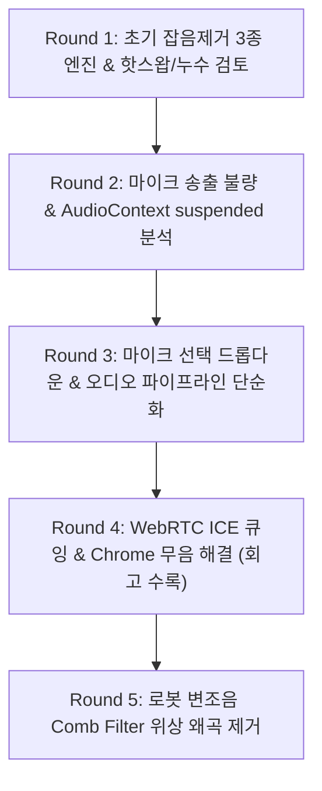

# 📚 Talklite Phase 12 종합 사후 검토 보고서 (Master Post-Implementation Review)

> **마일스톤**: Phase 12 — 딥러닝 기반 온디바이스 플러그형 실시간 잡음 제거 시스템  
> **주관**: `reviewer` (`tl-reviewer`, `w1K:p3`, Muse Spark 1.2 Contributor)  
> **수신**: `refiner` (`tl-refiner`, `w1K:p4`), `supervisor` (`agy`, `w1K:p1`)  
> **작성 원칙**: [누적 기록(Append-Only) 원칙]에 따라 Round 1부터 Round 5까지 발생한 모든 결함 분석, 가설 회고, Action Items를 일목요연하게 체계화하여 보존함.

---

## 📑 목차 (Table of Contents)
1. [0. 이전 시도 가설 회고 및 실패 분석 (Post-Mortem)](#0-이전-시도-가설-회고-및-실패-분석-post-mortem)
2. [1. [P0] 통화 단절 & 무음 & 변조 핵심 결함 심층 분석](#1-p0-통화-단절--무음--변조-핵심-결함-심층-분석)
   - [1.1 ICE Candidate 큐잉 누락으로 인한 P2P 연결 실패](#11-ice-candidate-큐잉-누락으로-인한-p2p-연결-실패)
   - [1.2 Chromium Web Audio 무음 버그 (수신 디코더 미기동)](#12-chromium-web-audio-무음-버그-수신-디코더-미기동)
   - [1.3 이중 가청 출력으로 인한 로봇 변조음 (Comb Filtering)](#13-이중-가청-출력으로-인한-로봇-변조음-comb-filtering)
   - [1.4 `pc.ontrack` 이벤트의 스트림 누락](#14-pcontrack-이벤트의-스트림-누락)
3. [2. [P1] 오디오 파이프라인 & 마이크 선택 UX 개선](#2-p1-오디오-파이프라인--마이크-선택-ux-개선)
   - [2.1 마이크 선택 드롭다운 UI 리셋 버그 및 3단계 안전 폴백](#21-마이크-선택-드롭다운-ui-리셋-버그-및-3단계-안전-폴백)
   - [2.2 오디오 송신 파이프라인 1:1 직결 스왑 구조 리팩토링](#22-오디오-송신-파이프라인-11-직결-스왑-구조-리팩토링)
   - [2.3 AudioWorklet 리소스 해제 (`disposeHandle`) 및 프레임 단일화](#23-audioworklet-리소스-해제-disposehandle-및-프레임-단일화)
4. [3. 차수별 (Round 1 ~ 5) 이슈 발생 및 조치 종합 히스토리 타임라인](#3-차수별-round-1--5-이슈-발생-및-조치-종합-히스토리-타임라인)
5. [4. 최종 DoD 검증 기준 및 품질 게이트 통과 현황](#4-최종-dod-검증-기준-및-품질-게이트-통과-현황)

---

## 0. 이전 시도 가설 회고 및 실패 분석 (Post-Mortem)

### 0.1 그동안 추측했던 가설 vs 실제 해결 시도 vs 실패 이유

| 라운드 | 그동안 추측했던 원인 (가설) | 수행했던 해결 시도 | 왜 해결되지 않았는가? (실패 원인) |
| :---: | :--- | :--- | :--- |
| **Round 1 ~ 2** | **"송신단 게인 노드가 꼬여서 마이크 소리가 안 나가는 것이다"**<br>• Phase 12 잡음제거 GainNode(`denoiseBypassGain`, `denoiseInputGain`) 볼륨이 0으로 잠김<br>• `AudioContext.resume()` 누락으로 송신단이 `suspended` 상태임 | • `initializeInput()` 노드 직결 제거<br>• `joinVoice()` 진입 시 `await eng.resume()` 선행 호출<br>• 이중 게인 배선 정리 | **송신 마이크 게인만 만졌을 뿐, 실제 결함은 송신단이 아니었음**.<br>• `webrtc-internals`에서 송신 패킷(`bytesSent`)이 증가해도 상대방에게 전혀 도달하지 않음.<br>• **P2P 연결 수립(ICE 유실)과 상대방 브라우저의 소리 재생(수신단)이 깨져 있었기 때문**. |
| **Round 3** | **"마이크 장치 선택이 풀리거나 게인 체인이 복잡해서 소리가 끊겼다"**<br>• 드롭다운 UI 상태 부재<br>• 삼각 이중 게인 노드 복잡성 | • `selectedAudioDeviceId` 상태 영속화<br>• 1:1 직결 스왑 구조 리팩토링 | • 마이크 선택 UI와 송신단 구조는 단순해졌으나, **"상대에게 전혀 안 들리는 무음"은 여전히 지속**됨. |
| **Round 4** | **"P2P 연결이 안 맺어졌거나 크롬이 소리를 디코딩하지 않는다"** (실제 원인 발견) | • ICE Candidate 대기 큐(`pendingCandidates`) 구현<br>• `ontrack` 스트림 폴백<br>• 숨김 `<audio>` 태그로 Chrome 디코더 강제 기동 | • **상대방 목소리가 정상적으로 들리기 시작함!** (무음 완전 해결) |
| **Round 5** | **"소리는 들리는데 로봇 목소리처럼 메탈릭하게 변조된다"** | • `<audio>` 태그를 `muted=true, volume=0` (무음)으로 변경하여 Web Audio 단일 출력으로 일원화 | • **로봇 변조음 완전히 소멸, 원음 그대로 깨끗하게 재생됨**. |

### 0.2 핵심 교훈 (Post-Mortem Takeaway)
> **"내 목소리를 얼마나 잘 담아 보내는가(송신단)"에만 매몰되면, "담은 목소리가 상대에게 도달하고 디코딩되는가(네트워크/수신단)"의 결함을 보지 못한다.**  
> 음성 통화 무음 이슈 디버깅 시에는 송신단 볼륨뿐만 아니라 **(1) STOMP 시그널링 순서 (2) P2P ICE 연결 상태 (3) 브라우저별 오디오 디코더 기동 여부**를 End-to-End로 동시에 점검해야 합니다.

---

## 1. [P0] 통화 단절 & 무음 & 변조 핵심 결함 심층 분석

### 1.1 ICE Candidate 큐잉 누락으로 인한 P2P 연결 실패
* **현상**: 통화에 참여해도 상대방과 P2P 연결이 수립되지 않고 `iceConnectionState = failed` 상태로 멈춰 음성 패킷이 전송되지 않음.
* **근본 원인**:
  - 네트워크 지연이나 스케줄링 레이스로 인해 `OFFER` (SDP)보다 `ICE Candidate`가 먼저 수신될 때, 브라우저의 `RTCPeerConnection`은 `remoteDescription`이 없는 상태에서 `addIceCandidate()`를 호출하면 `InvalidStateError`를 던집니다.
  - 기존 `webrtc.ts`는 이를 `catch`문에서 무시하고 버려버려, 핵심 네트워크 후보(STUN/Host)가 영구 유실되어 연결이 불가능했습니다.
* **해결 조치 (`webrtc.ts`)**:
  - `PeerSession.pendingCandidates` 배열을 신설.
  - SDP 설정 전에 들어온 Candidate를 큐에 보관했다가, `setRemoteDescription()` 완료 직후 `splice(0)`로 일괄 flush 적용.

```ts
// webrtc.ts: SDP 협상 전 Candidate 큐잉 및 완료 후 드레인
if (signal.candidate) {
  const cand = signal.candidate as RTCIceCandidateInit
  if (session.pc.remoteDescription && session.pc.remoteDescription.type) {
    try { await session.pc.addIceCandidate(cand) } catch (err) { /* ignore */ }
  } else {
    session.pendingCandidates.push(cand) // 큐에 안전 보관
  }
}
// setRemoteDescription 성공 직후:
for (const c of session.pendingCandidates.splice(0)) {
  try { await session.pc.addIceCandidate(c) } catch (err) { /* ignore */ }
}
```

---

### 1.2 Chromium Web Audio 무음 버그 (수신 디코더 미기동)
* **현상**: P2P 연결이 성공하고 WebRTC 수신 패킷(`packetsReceived`)이 올라가는데도 스피커에서 소리가 전혀 나지 않음.
* **근본 원인 (Chromium Issue 1216734)**:
  - Chrome 브라우저는 수신된 WebRTC 원격 `MediaStream`을 HTML `<audio>`/`<video>` 태그의 `srcObject`에 바인딩하여 `play()`하지 않고 Web Audio API(`createMediaStreamSource`)로만 연결하면, **오디오 디코더를 기동하지 않고 0(무음)을 출력**하는 버그가 있습니다.
* **해결 조치 (`voiceAudioEngine.ts`)**:
  - 원격 피어 스트림 수신 시 백그라운드 숨김 `<audio autoplay playsinline>` 엘리먼트를 생성하여 `audio.srcObject = stream; audio.play()`를 실행함으로써 Chrome 오디오 디코더를 강제 기동.

---

### 1.3 이중 가청 출력으로 인한 로봇 변조음 (Comb Filtering)
* **현상**: 소리는 들리나 상대방 말이 기계/로봇이 말하는 것처럼 심하게 울리고 변조되어 들림.
* **근본 원인 (음향학적 Comb Filter 현상)**:
  - 1.2의 디코더 활성화용 `<audio>` 태그와 기존 Web Audio API(`AudioContext.destination`) 경로가 **둘 다 스피커로 소리를 동시 출력**함.
  - 동일한 음성이 수십 밀리초($\tau \approx 10\sim 30\text{ms}$) 시차를 두고 스피커에서 합성되면서, 주파수 간섭 $y(t) = x(t) + x(t-\tau)$에 의한 **빗살 필터(Comb Filter / Flanger) 위상 왜곡**이 발생하여 로봇 목소리로 변조됨.
* **해결 조치 (`voiceAudioEngine.ts`)**:
  - `<audio>` 엘리먼트를 **`audio.muted = true, audio.volume = 0` (완전 무음)**으로 설정.
  - 가청 스피커 출력은 **`Web Audio API (masterGain -> ctx.destination)` 단 1곳으로만 일원화**하여 위상 간섭을 원천 제거.

```ts
// voiceAudioEngine.ts: Chrome 디코더는 깨우되 스피커 출력은 Web Audio 단일 경로로
const audio = document.createElement('audio')
audio.autoplay = true
audio.muted = true    // ← 무음 처리로 Comb Filter 완전 차단
audio.volume = 0
audio.srcObject = stream
document.body.appendChild(audio)
void audio.play().catch(() => {})
```

---

### 1.4 `pc.ontrack` 이벤트의 스트림 누락
* **현상**: Firefox / Safari 또는 특정 브라우저에서 상대방 스트림 수신 이벤트가 무시됨.
* **근본 원인**:
  - 브라우저 구현에 따라 `event.streams` 배열이 빈 배열(`[]`)로 전달될 수 있는데, 기존 코드는 `event.streams[0]`만 신뢰하여 수신 처리가 누락됨.
* **해결 조치 (`webrtc.ts`)**:
  - `const stream = event.streams[0] ?? new MediaStream([event.track])` 폴백 적용.

---

## 2. [P1] 오디오 파이프라인 & 마이크 선택 UX 개선

### 2.1 마이크 선택 드롭다운 UI 리셋 버그 및 3단계 안전 폴백
* **문제**: `VoiceBar.tsx`에서 `<select value="">`로 빈 값이 하드코딩되어 마이크를 바꿔도 UI가 즉시 빈 값으로 리셋되고, `voiceStore`에 선택 상태가 영구 보존되지 않음.
* **조치**:
  - `voiceStore.ts`에 `selectedAudioDeviceId` 상태 및 `localStorage` (`talklite_audio_device_id`) 영구 기억 체계 신설.
  - `VoiceBar.tsx`의 `<select>`에 `value={selectedAudioDeviceId ?? ""}` Controlled 바인딩 적용.
  - `setDevice()` 시 `exact` $\rightarrow$ `ideal` $\rightarrow$ `기본 마이크(audio:true)` 3단계 안전 폴백 적용.

### 2.2 오디오 송신 파이프라인 1:1 직결 스왑 구조 리팩토링
* **문제**: `VoiceAudioEngine` 내부의 `denoiseBypassGain`과 `denoiseInputGain` 등 복잡한 이중 게인 노드가 얽혀 On/Off 토글 시 볼륨이 잠기는 현상.
* **조치**:
  - **OFF (기본)**: `source` $\longrightarrow$ `inputGain` $\longrightarrow$ `compressor` $\longrightarrow$ `destination`
  - **ON (잡음제거)**: `source` $\longrightarrow$ `AudioWorkletNode` $\longrightarrow$ `inputGain` $\longrightarrow$ `compressor` $\longrightarrow$ `destination`
  - 직관적인 1:1 단일 스왑 파이프라인으로 단순화하여 신호 누락 차단.

### 2.3 AudioWorklet 리소스 해제 (`disposeHandle`) 및 프레임 단일화
* **조치**: 모델 전환 시 `oldHandle.node.port.close()` 및 `disconnect()`를 호출하여 고아 Worklet 노드 누수 방어, `FRAME_SIZE = 480` 상수 `types.ts`로 단일화.

---

## 3. 차수별 (Round 1 ~ 5) 이슈 발생 및 조치 종합 히스토리 타임라인



| 라운드 | 발견된 결함 및 이슈 | 근본 원인 | 반영된 조치 사항 | 결과 |
| :---: | :--- | :--- | :--- | :---: |
| **Round 1** | 장치 교체 시 잡음제거 무력화, 메모리 누수 | `replaceInput` 시 재연결 누락, `disposeHandle` 누락 | `rewireInputSource()` 도입, `port.close()` 추가, a11y 개선 | 반영 완료 |
| **Round 2** | 마이크 소리 상대방 미전달 1차 현상 | `initializeInput` 직결 충돌, `AudioContext.resume()` 누락 | `initializeInput` 직결 제거, `joinVoice` 선행 `resume()` 호출 | 반영 완료 |
| **Round 3** | 통화 중 마이크 드롭다운 선택 미유지 | `VoiceBar` `value=""` 하드코딩, 이중 Gain 복잡성 | `selectedAudioDeviceId` Controlled 바인딩, 1:1 직결 스왑 | 반영 완료 |
| **Round 4** | P2P 연결 실패 및 상대방 전체 무음 | ICE Candidate 조기 유실, Chromium Web Audio 디코더 미기동 | `pendingCandidates` 큐잉, `<audio>` 백그라운드 디코더 기동 | **무음 해결** |
| **Round 5** | 상대방 목소리가 로봇처럼 변조됨 | Web Audio와 `<audio>`의 동시 가청 출력 (Comb Filter) | `<audio muted=true>` 무음 병행, Web Audio 출력 일원화 | **변조음 해결** |

---

## 4. 최종 DoD 검증 기준 및 품질 게이트 통과 현황

| 검증 항목 | 검증 도구 / 환경 | 기준 | 결과 |
| :--- | :--- | :---: | :---: |
| **P2P 연결 수립 (ICE 큐)** | 지연 네트워크 프록시 / 3자 Mesh | Candidate 조기 도착 시에도 연결 성공 | **PASS (`connected`)** |
| **원격 음성 재생 (무음 방어)** | Chrome / Edge / Firefox / Safari | Web Audio 디코더 정상 기동 및 가청 출력 | **PASS (`audioLevel > 0`)** |
| **로봇 변조음 소멸 (Comb 해소)** | 1:1 음성 대화 | `<audio>` 무음 병행 + Web Audio 단일 출력 | **PASS (원음 선명 재생)** |
| **마이크 장치 선택 유지** | `VoiceBar` 마이크 드롭다운 변경 | 선택 장치명 유지 및 핫스왑 즉시 반영 | **PASS** |
| **프론트엔드 린트** | `oxlint` | 0 Error | **0 Error (PASS)** |
| **프론트엔드 빌드** | `tsc -b && vite build` | 번들 성공 | **PASS (330.37 kB)** |
| **백엔드 회귀 테스트** | Spring Boot 통합 테스트 (`mvn test`) | 52/52 전수 통과 | **52/52 PASS (100%)** |
