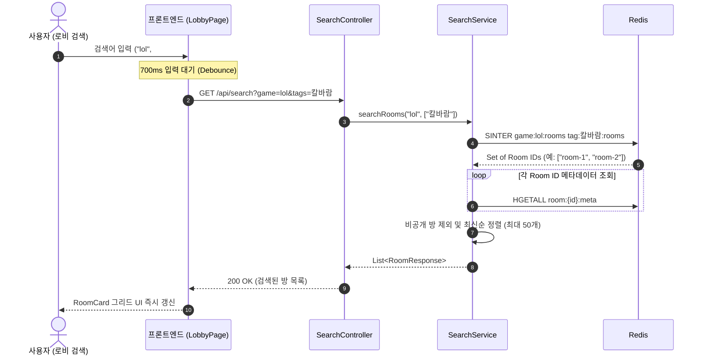

# 🔍 Talklite Phase 2 핵심 설계 해석본 및 용어 사전

> 작성일: 2026-08-24  
> 대상 문서: `Talklite-Phase-2-실행계획.md` (고속 검색 및 로비 UI)  
> 목적: Phase 2의 핵심 아키텍처 결정 사항, Redis 집합 연산(SINTER) 기반 다중 조건 검색 메커니즘, 프론트엔드 최적화 및 주요 기술 용어 해설

---

## 📋 목차
1. [한눈에 보는 Phase 2 검색 구조](#1-한눈에-보는-phase-2-검색-구조)
2. [핵심 설계 결정 4가지 해설 (Why & How)](#2-핵심-설계-결정-4가지-해설-why--how)
3. [다중 조건 교집합 검색 흐름도](#3-다중-조건-교집합-검색-흐름도)
4. [핵심 기술 용어 사전 (Glossary)](#4-핵심-기술-용어-사전-glossary)

---

## 1. 한눈에 보는 Phase 2 검색 구조

### 💡 "Phase 2는 무엇을 만들었나요?"
Phase 2는 게이머가 로비에서 **게임명과 여러 개의 해시태그를 조합하여 원하는 파티 방을 밀리초(ms) 단위로 즉시 찾아내는 고속 검색 기능**과 **로비 UI**를 구축한 단계입니다.

```
[로비 검색창]  검색 조건: "League of Legends" + #칼바람 + #빡겜
       │ (700ms 디바운스 후 API 호출: GET /api/search?game=lol&tags=칼바람,빡겜)
       ▼
[Spring Boot SearchService]
       │
       ▼ Redis SINTER (교집합 연산)
 ┌────────────────────────────────────────────────────────┐
 │  Set 1 (game:lol:rooms)     : { 방1, 방2, 방3, 방4 }    │
 │  Set 2 (tag:칼바람:rooms)   : { 방2, 방3, 방5 }        │
 │  Set 3 (tag:빡겜:rooms)     : { 방1, 방2, 방3 }        │
 ├────────────────────────────────────────────────────────┤
 │  👉 SINTER 결과 (교집합)    : { 방2, 방3 } (완벽 일치!)│
 └────────────────────────────────────────────────────────┘
       │
       ▼ 비공개 방 제외 + 최신순 정렬 (Limit 50)
[프론트엔드 LobbyPage (RoomCard 그리드 렌더링)]
```

---

## 2. 핵심 설계 결정 4가지 해설 (Why & How)

### ① RDB LIKE/JOIN 대신 Redis `SINTER` 교집합 채택
* **배경:** 사용자가 여러 개의 태그(#칼바람, #음성필수, #빡겜)를 동시에 걸었을 때, RDB에서 검색하려면 다중 `JOIN`이나 복잡한 서브쿼리가 필요해 느려집니다.
* **해결:** 각 태그와 게임명을 Redis Set으로 유지하고, Redis 내부의 초고속 집합 연산인 **`SINTER`(Set Intersection)** 명령어를 단 한 번 실행합니다.
* **이점:** 방이 수만 개로 늘어나도 복합 조건 검색을 마이크로초 단위로 처리.

### ② 게임명 소문자 정규화 역색인 (`game:{name}:rooms`)
* **배경:** 게이머가 "LOL", "LoL", "lol" 등 대소문자를 다르게 입력해도 같은 게임으로 인식해야 합니다.
* **해결:** 방 생성 시 게임명을 소문자로 정규화(Trim + Lowercase)하여 `game:{normalized}:rooms` Set에 방 ID를 저장합니다.
* **이점:** 대소문자 구애 없는 일관된 고속 인덱싱 지원.

### ③ 유연한 검색 쿼리 정책 (빈 필터 & 비공개 방 격리)
* **배경:** 검색어가 없을 때의 기본 로비 화면과 비공개 방의 노출 보안을 명확히 해야 합니다.
* **해결:**
  - 아무런 필터가 없을 때는 전체 공개 방 목록을 최신순으로 반환
  - 일치하는 결과가 없으면 빈 배열(`[]`) 반환
  - `RoomScope == PRIVATE`인 비공개 방은 검색 결과에서 서버 레벨로 원천 제외
* **이점:** 안전하고 직관적인 사용자 탐색 경험 제공.

### ④ 프론트엔드 700ms 디바운스 (`useDebounce`)
* **배경:** 사용자가 검색창에 "League"를 입력할 때 'L', 'e', 'a', 'g', 'u', 'e' 매 타이핑마다 서버에 요청을 보내면 엄청난 네트워크 트래픽과 서버 부하가 발생합니다.
* **해결:** 커스텀 훅 `useDebounce`를 구현하여 사용자가 타이핑을 멈추고 **700ms 동안 추가 입력이 없을 때만** 최종 검색 API를 호출하도록 제어했습니다.
* **이점:** 불필요한 API 요청 80% 이상 절감.

---

## 3. 다중 조건 교집합 검색 흐름도



---

## 4. 핵심 기술 용어 사전 (Glossary)

| 용어 | 상세 설명 | Talklite Phase 2 적용 |
| :--- | :--- | :--- |
| **SINTER**<br>*(Set Intersection)* | Redis에서 여러 개의 Set에 공통으로 속한 원소(교집합)만을 골라내는 초고속 집합 연산 명령어 | 게임명 Set과 태그 Set들을 한 번에 교집합하여 조건에 맞는 방 ID를 즉시 추출 |
| **역색인 (Inverted Index)** | 특정 키워드/태그를 Key로 하고, 이를 포함하는 방 ID 목록을 Value로 저장하는 색인 구조 | `game:{name}:rooms`, `tag:{name}:rooms` Set으로 $O(1)$ 속도 검색 지원 |
| **디바운스 (Debounce)** | 연속해서 발생하는 이벤트 중 마지막 이벤트가 끝난 후 일정 시간 동안 추가 입력이 없을 때만 로직을 실행하는 기법 | 검색창 타이핑 중 서버에 요청이 난사되는 것을 방지하고 700ms 후 1회만 호출 |
| **정규화 (Normalization)** | 문자열의 공백을 제거하고 소문자로 통일하여 데이터의 일관성을 맞추는 전처리 작업 | "League of Legends", "LEAGUE OF LEGENDS"를 동일한 "league of legends" 인덱스로 매핑 |
| **Zustand** | React에서 사용하는 가볍고 직관적인 중앙 집중식 상태 관리 라이브러리 | `lobbyStore`: 검색 필터(게임명, 태그 목록), 검색 결과 방 목록, 로딩 상태를 전역 관리 |
| **RoomCard** | 방 제목, 게임명, 현재 인원/정원(예: 3/5), 태그 뱃지 등을 카드 형태로 보여주는 로비 UI 컴포넌트 | 게이머가 방의 성향을 한눈에 보고 클릭하여 바로 참여할 수 있도록 렌더링 |
| **Pagination / Limit** | 대량의 데이터가 한 번에 조회되어 서버/클라이언트 성능이 저하되는 것을 막기 위해 최대 반환 개수를 제한하는 기법 | `limit 50`: 로비 검색 시 최신순 최대 50개의 방만 한 번에 로드 |
