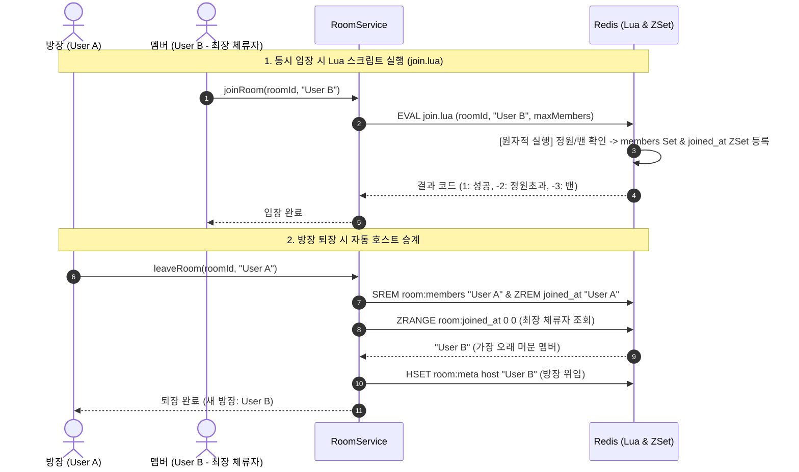

# ⚡ Talklite Phase 3 핵심 설계 해석본 및 용어 사전

> 작성일: 2026-08-24  
> 대상 문서: `Talklite-Phase-3-실행계획.md` (동시성 제어 & 호스트 위임 & 강퇴)  
> 목적: Phase 3의 핵심 아키텍처 결정 사항, Redis Lua Script를 통한 원자적 정원 검증, ZSet 기반 체류 시간 방장 자동 위임, 밴 시스템 및 주요 기술 용어 해설

---

## 📋 목차
1. [한눈에 보는 Phase 3 동시성 & 방 관리 구조](#1-한눈에-보는-phase-3-동시성--방-관리-구조)
2. [핵심 설계 결정 4가지 해설 (Why & How)](#2-핵심-설계-결정-4가지-해설-why--how)
3. [원자적 정원 검증 & 방장 위임 시퀀스 다이어그램](#3-원자적-정원-검증--방장-위임-시퀀스-다이어그램)
4. [핵심 기술 용어 사전 (Glossary)](#4-핵심-기술-용어-사전-glossary)

---

## 1. 한눈에 보는 Phase 3 동시성 & 방 관리 구조

### 💡 "Phase 3은 무엇을 해결했나요?"
Phase 3은 여러 게이머가 동시에 한 방에 입장할 때 발생하는 **정원 초과(동시성 경쟁) 문제**, 방장이 방을 나갔을 때의 **권한 승계 문제**, 악성 유저를 방어하기 위한 **강퇴 및 밴(Ban) 시스템**을 구축한 단계입니다.

```
[동시 입장 요청 10건 동시 인입]
             │
             ▼
[Redis Lua Script (join.lua)]  <-- 싱글 스레드로 원자적 1건씩 완벽 처리!
 ┌──────────────────────────────────────────────────────────┐
 │ 1. 밴(Ban) 여부 확인      --> 밴 유저면 즉시 거부 (-3)    │
 │ 2. 정원 초과 여부 확인    --> 정원 초과면 즉시 거부 (-2)  │
 │ 3. 이미 참여 중인지 확인  --> 이미 있으면 통과 (1)        │
 │ 4. 신규 참여자 등록       --> 멤버 Set & ZSet 추가 (1)   │
 └──────────────────────────────────────────────────────────┘
             │
             ├──> 1등 요청 : 입장 성공 (200 OK)
             └──> 2~10등 요청: 409 RoomFullException (정원 초과 방어!)
```

---

## 2. 핵심 설계 결정 4가지 해설 (Why & How)

### ① Redis Lua Script (`join.lua`) 기반 원자적 정원 검증
* **배경:** 정원이 1자리 남은 방에 2명 이상의 유저가 1ms 차이로 입장 버튼을 누르면, Java 애플리케이션 레벨의 단순 if문(`if (current < max)`)으로는 둘 다 "자리 있음"으로 판단하여 정원 초과(5/4명)가 발생하는 **TOCTOU(Time-of-Check to Time-of-Use) 버그**가 생깁니다.
* **해결:** 검사와 입장 처리를 Redis 내부에서 하나의 트랜잭션으로 실행하는 **Lua Script**로 작성했습니다.
* **이점:** 분산 락(Redlock) 같은 무거운 오버헤드 없이, Redis의 싱글 스레드 특성을 활용해 1ms 내에 원자적(Atomic) 정원 방어 달성 (테스트 T-01 통과).

### ② 체류 시간 기반 방장 자동 위임 (`room:{id}:joined_at` ZSet)
* **배경:** 방장이 게임 도중 방을 나가버리면 방이 주인을 잃거나 누구에게 권한을 넘겨야 할지 모호해집니다.
* **해결:** 유저가 방에 들어온 시점의 타임스탬프(`epoch ms`)를 점수(Score)로 하는 **Redis Sorted Set(ZSet)**을 운영합니다.
* **동작:** 방장 퇴장 시 ZSet에서 점수가 가장 낮은(방에 가장 오래 머무른) 참여자를 찾아 자동으로 새 방장(`meta.host`)으로 위임합니다 (테스트 T-04 통과).

### ③ 2단계 강퇴 및 밴(Ban) 시스템 (`KickService`)
* **배경:** 트롤러나 비매너 게이머를 방장이 내쫓았을 때 바로 다시 들어오지 못하게 막아야 합니다.
* **해결:**
  - **임시 밴:** `room:{id}:banned:{user}` (Redis String, TTL 10분) $\rightarrow$ 10분간 해당 방 재입장 차단
  - **영구 밴:** `room:{id}:banned` (Redis Set) $\rightarrow$ 방이 사라질 때까지 영구 차단
  - 강퇴 즉시 방 멤버 Set에서 제거 및 ZSet 체류 기록 파기
* **이점:** 악성 유저의 무차별 재진입 공격 원천 차단 (테스트 T-07 통과).

### ④ 단일 책임 원칙 (RoomService와 KickService 분리)
* **배경:** `RoomService`가 방 생성/입퇴장뿐만 아니라 강퇴 권한 검증, 밴 정책까지 모두 가지면 클래스가 비대해집니다.
* **해결:** 강퇴 및 밴 관련 비즈니스 로직을 전담하는 `KickService`를 별도 분리했습니다.
* **이점:** 코드 응집도 증가 및 모듈별 독립적인 단위/통합 테스트 가능.

---

## 3. 원자적 정원 검증 & 방장 위임 시퀀스 다이어그램



---

## 4. 핵심 기술 용어 사전 (Glossary)

| 용어 | 상세 설명 | Talklite Phase 3 적용 |
| :--- | :--- | :--- |
| **원자성 (Atomicity)** | 여러 작업이 하나의 단위로 묶여 "모두 성공하거나 모두 실패"하여 중간 상태가 존재하지 않는 성질 | 정원 검사와 멤버 추가가 분리되지 않고 단일 작업으로 완벽하게 실행 |
| **TOCTOU 버그**<br>*(Time-of-Check to Time-of-Use)* | 조건을 검사한 시점과 실제 데이터를 변경하는 시점 사이의 틈에 상태가 바뀌어 발생하는 동시성 결함 | Java 레벨의 if 검사 대신 Redis Lua Script를 도입하여 완벽 제거 |
| **Redis Lua Script** | Redis 서버 내부에서 내장 Lua 엔진을 통해 여러 명령어를 락 없이 원자적으로 일괄 실행하는 기능 | `join.lua`: 밴 확인 $\rightarrow$ 정원 확인 $\rightarrow$ Set 등록을 1ms 내 트랜잭션으로 처리 |
| **ZSet (Sorted Set)** | 원소(Member)마다 숫자 점수(Score)를 가지고 있어 항상 점수 순으로 정렬을 유지하는 Redis 자료구조 | `room:{id}:joined_at`: 유저의 입장 시각을 점수로 저장하여 최장 체류자를 $O(\log N)$으로 즉시 추출 |
| **경쟁 상태 (Race Condition)** | 두 개 이상의 스레드가 공유 자원에 동시에 접근하여 타이밍에 따라 데이터 정합성이 깨지는 현상 | 마지막 남은 1자리에 동시 클릭 시 정원이 5/4명으로 초과되는 버그 방지 |
| **TTL**<br>*(Time To Live)* | 데이터가 메모리에 유지되는 유효 수명 시간 (시간 경과 시 Redis가 자동 삭제) | 임시 밴 `room:{id}:banned:{user}`에 600초(10분) TTL을 부여하여 10분 후 자동 해제 |
| **호스트 마이그레이션 (Host Migration)** | P2P나 방 기반 서비스에서 방장이 이탈했을 때 남아있는 다른 참여자에게 방장 권한을 넘겨주는 기술 | 방장 퇴장 시 ZSet 기반으로 가장 오래 방에 머문 사람에게 방장 권한을 자동 승계 |
| **409 Conflict** | 요청이 서버의 현재 상태와 충돌하여 수행할 수 없음을 나타내는 HTTP 표준 에러 코드 | 방 정원이 꽉 찼을 때(`RoomFullException`) 클라이언트에게 반환하는 상태 코드 |
