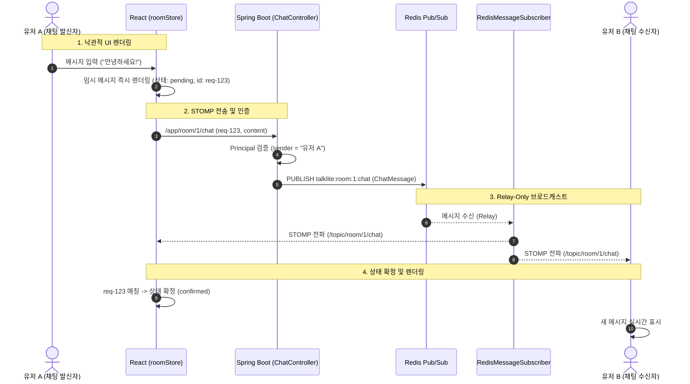

# 💬 Talklite Phase 4 핵심 설계 해석본 및 용어 사전

> 작성일: 2026-08-24  
> 대상 문서: `Talklite-Phase-4-실행계획.md` (실시간 동기화 & STOMP 채팅 & 초대코드)  
> 목적: Phase 4의 핵심 아키텍처 결정 사항, Relay-Only Redis Pub/Sub 브로드캐스트 패턴, 익명 사전 인증, 비공개 방 6자리 초대코드, 가상화 낙관적 채팅 및 주요 기술 용어 해설

---

## 📋 목차
1. [한눈에 보는 Phase 4 실시간 아키텍처](#1-한눈에-보는-phase-4-실시간-아키텍처)
2. [핵심 설계 결정 5가지 해설 (Why & How)](#2-핵심-설계-결정-5가지-해설-why--how)
3. [실시간 브로드캐스트 & 낙관적 채팅 흐름도](#3-실시간-브로드캐스트--낙관적-채팅-흐름도)
4. [핵심 기술 용어 사전 (Glossary)](#4-핵심-기술-용어-사전-glossary)

---

## 1. 한눈에 보는 Phase 4 실시간 아키텍처

### 💡 "Phase 4는 무엇을 만들었나요?"
Phase 4는 방 내 참여자 간 **실시간 텍스트 채팅**, 입퇴장/방 상태의 **실시간 동기화**, 비공개 방 진입을 위한 **6자리 난수 초대코드**, 그리고 익명 사용자 대상 **WebSocket 보안 인증**을 구축한 핵심 단계입니다.

```
[클라이언트 1 (React)]                      [클라이언트 2 (React)]
       │ (1. STOMP 채팅 전송)                      ▲
       ▼                                           │ (4. STOMP 푸시)
[Spring Boot (ChatController)]             [Spring Boot (Subscriber)]
       │                                           ▲
       └──> (2. Redis Publish)                     │ (3. Redis Broadcast)
              ▼                                    │
       [Redis Pub/Sub Channel (talklite:room:1:chat)]
```

---

## 2. 핵심 설계 결정 5가지 해설 (Why & How)

### ① Relay-Only Pub/Sub 브로드캐스트 패턴 (단일 브로드캐스트 원칙)
* **배경:** 스프링 부트 서버가 여러 대로 스케일아웃(다중화)되면, 컨트롤러에서 직접 클라이언트로 메시지를 보낼 경우 다른 서버에 접속 중인 사용자에게는 메시지가 전달되지 않습니다. 또한 자체 전파와 Redis 전파를 동시에 하면 메시지가 2번 발송(**이중 발송**)됩니다.
* **해결:** 컨트롤러나 서비스에서는 오직 **Redis Pub/Sub 채널로만 메시지를 발행(Publish)**하고, `RedisMessageSubscriber`가 단독으로 수신하여 해당 인스턴스의 WebSocket 클라이언트들에게 STOMP로 뿌려주는 **Relay-Only 패턴**을 확립했습니다.
* **이점:** 서버가 수십 대로 늘어나도 메시지 중복이나 유실 없이 완벽한 다중 인스턴스 실시간 동기화 보장.

### ② 익명 세션 토큰 & WebSocket 사전 인증 (NFR-SEC-01)
* **배경:** 회원가입이 없는 익명 서비스이므로, 악성 사용자가 WebSocket 패킷의 발신자 이름(`sender: "방장"`)을 마음대로 조작해 사칭할 위험이 있습니다.
* **해결:**
  1. 클라이언트 진입 시 `POST /api/session`으로 24시간 TTL을 가진 세션 토큰(`session:{token}`)을 발급받습니다.
  2. WebSocket `CONNECT` 시 헤더의 Bearer 토큰을 인터셉터(`WebSocketAuthInterceptor`)에서 검증하여 STOMP 세션에 `StompPrincipal`을 바인딩합니다.
  3. `@MessageMapping` 핸들러는 클라이언트가 보낸 sender를 무시하고, 인증된 `Principal.getName()`을 강제로 발신자로 사용합니다.
* **이점:** 익명 서비스의 편의성을 유지하면서도 발신자 위변조를 완벽 차단.

### ③ 비공개 방 6자리 초대코드 시스템 (FR-ROOM-04, NFR-SEC-02)
* **배경:** 친구들끼리만 비밀스럽게 게임하고 싶을 때 복잡한 비밀번호 입력 대신 짧고 직관적인 초대코드가 필요합니다.
* **해결:**
  - 비공개(`PRIVATE`) 방에 직접 입장 API를 호출하면 403 `invite_required`로 차단
  - 6자리 영숫자 난수를 생성하여 `SET invite:{code} {roomId} NX EX 86400`으로 원자적 등록 (충돌 시 최대 3회 재시도)
  - 입장은 오직 `POST /api/invite/{code}/join`으로만 허용
* **이점:** 직관적인 6자리 코드로 안전하고 간편한 비공개 파티 초대 지원 (테스트 T-09 통과).

### ④ 낙관적 업데이트(Optimistic UI) & 가상화 채팅창
* **배경:** 메시지를 보낼 때마다 서버 응답을 기다리면 채팅이 뚝뚝 끊기는 느낌이 들고, 수천 개의 채팅이 쌓이면 브라우저가 버벅거립니다.
* **해결:**
  - **낙관적 UI:** 메시지 입력 즉시 고유한 `clientRequestId`를 달아 화면에 `pending` 상태로 띄우고, 서버 에코 수신 시 `confirmed`로 전환 (3초 내 미도착 시 `failed` 표시)
  - **가상화 스크롤:** `@tanstack/react-virtual`을 도입해 메시지가 10,000개 쌓여도 사용자의 화면에 보이는 20~30개만 DOM으로 렌더링
* **이점:** 디스코드급의 즉각적인 채팅 반응 속도 및 초경량 렌더링 성능 확보 (테스트 T-08 통과).

### ⑤ 퇴장 시 보이스 뱃지 누수 방지 (FR-VOICE-05 연동)
* **배경:** 음성 통화 중이던 유저가 통화 종료 버튼을 안 누르고 그냥 방을 나가버리면 로비의 "🎙️ 통화 중 N명" 뱃지에 유령 인원이 남게 됩니다.
* **해결:** `RoomService.leaveRoom` 및 `KickService.kick` 실행 시 `room:{id}:voice` Set에서 유저를 함께 `SREM`하고 즉시 `VOICE_BADGE_UPDATE` 이벤트를 로비로 발행합니다.
* **이점:** 비정상 퇴장 시에도 로비와 방 내 통화 인원수의 완벽한 실시간 정합성 유지.

---

## 3. 실시간 브로드캐스트 & 낙관적 채팅 흐름도



---

## 4. 핵심 기술 용어 사전 (Glossary)

| 용어 | 상세 설명 | Talklite Phase 4 적용 |
| :--- | :--- | :--- |
| **WebSocket** | 웹 브라우저와 서버 간에 단일 TCP 연결을 통해 실시간 양방향 전이중(Full-Duplex) 통신을 가능하게 하는 프로토콜 | `/ws`: HTTP의 단방향 요청/응답 한계를 넘어 실시간 채팅과 이벤트를 즉시 푸시 |
| **STOMP** | WebSocket 위에서 작동하는 텍스트 기반 프레임 규약으로, 토픽(Topic) 기반의 발행/구독 모델을 제공 | `/app/room/{id}/...`로 명령을 발행하고 `/topic/room/{id}/...`로 이벤트를 구독 |
| **Relay-Only 패턴** | 서버 인스턴스가 STOMP 메시지를 자체적으로 직접 전파하지 않고, **오직 Redis Pub/Sub을 거쳐서만 전파**하는 구조 | 서버 클러스터링(다중화) 환경에서 메시지 중복 발송을 막고 완벽한 브로드캐스트 보장 |
| **Redis Pub/Sub** | Redis의 고속 인메모리 메시지 브로커 기능 (발행자가 채널에 메시지를 쏘면 구독 중인 모든 서버가 즉시 수신) | `talklite:room:{id}:*` 채널을 통해 서버 간 실시간 이벤트를 중계 |
| **StompPrincipal** | WebSocket 연결 시 인증된 사용자의 고유 신원(Identity) 정보를 담고 있는 보안 객체 | 익명 세션 토큰을 검증해 주입하며, `@MessageMapping`에서 위조 불가능한 발신자 ID로 활용 |
| **낙관적 업데이트 (Optimistic UI)** | 서버의 응답을 기다리지 않고 클라이언트 화면을 먼저 성공 상태로 갱신하여 체감 속도를 극대화하는 UX 기법 | 채팅 전송 즉시 말풍선을 띄우고 `clientRequestId` 에코로 상태를 확정(3초 타임아웃 롤백) |
| **가상화 리스트 (List Virtualization)** | 리스트 아이템이 수천 개가 되어도 사용자의 화면(Viewport)에 보이는 수십 개만 DOM에 마운트하는 기법 | `@tanstack/react-virtual`: 채팅창에 메시지가 1만 개 쌓여도 60fps 부드러운 스크롤 유지 |
| **원자적 발급 (SET NX EX)** | Key가 존재하지 않을 때만 생성(NX)하고 만료 시간(EX)을 한 번에 설정하는 Redis 원자 명령어 | 6자리 초대코드(`invite:{code}`)를 중복 없이 생성하고 24시간 후 자동 파기 |
| **403 Forbidden** | 클라이언트가 인증은 되었으나 해당 자원에 접근할 권한이 없음을 알리는 HTTP 표준 상태 코드 | 비공개 방에 초대코드 없이 직접 접근 시 `invite_required` 에러 반환 |
