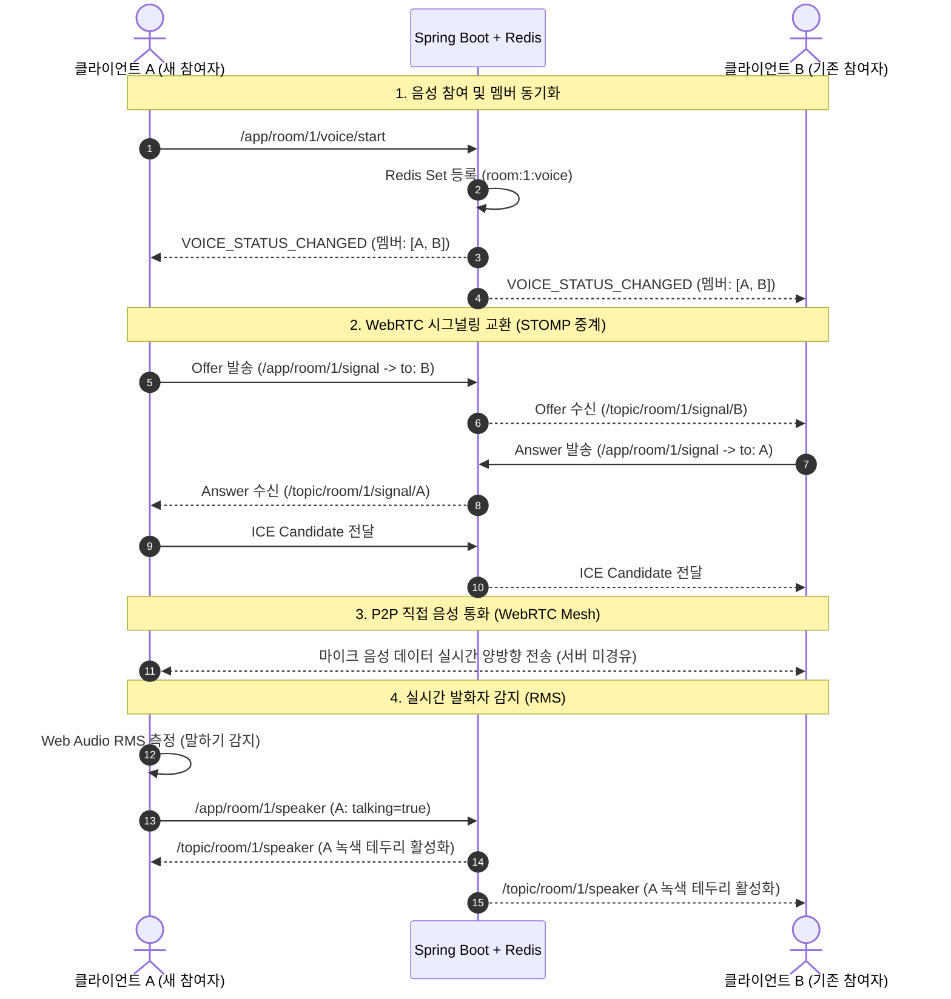

# 🎙️ Talklite Phase 5 핵심 설계 해석본 및 용어 사전

> 작성일: 2026-08-24  
> 대상 문서: `Talklite-Phase-5-실행계획.md` (WebRTC Mesh 보이스 & 시그널링 & 발화자 감지)  
> 목적: Phase 5의 핵심 아키텍처 결정 사항, 데이터/미디어 흐름, 그리고 주요 기술 용어를 알기 쉽게 해설

---

## 📋 목차
1. [한눈에 보는 WebRTC 음성 통화 구조](#1-한눈에-보는-webrtc-음성-통화-구조)
2. [핵심 설계 결정 5가지 해설 (Why & How)](#2-핵심-설계-결정-5가지-해설-why--how)
3. [클라이언트 & 서버 간 상세 흐름도](#3-클라이언트--서버-간-상세-흐름도)
4. [핵심 기술 용어 사전 (Glossary)](#4-핵심-기술-용어-사전-glossary)

---

## 1. 한눈에 보는 WebRTC 음성 통화 구조

### 💡 "WebRTC 음성 통화는 어떻게 이루어지나요?"
WebRTC는 **서버를 거치지 않고 사용자(웹 브라우저)끼리 직접 음성 데이터를 주고받는 기술(P2P)**입니다.  
하지만 브라우저끼리 서로 연결되려면 사전에 **"내 IP 주소가 무엇이고, 어떤 오디오 코덱을 지원하는지"**에 대한 정보를 먼저 교환해야 합니다.

```
[클라이언트 A]  ---- (1. 주소/오디오 스펙 교환: STOMP 서버 중계) ----> [클라이언트 B]
[클라이언트 A]  <=================================================> [클라이언트 B]
                            (2. 실제 목소리: P2P 직접 통신)
```

* **서버(Spring Boot + Redis)의 역할 = "교환원"**:  
  사용자들이 통화를 시작하기 전 서로의 연락처/주소(SDP, ICE Candidate)를 안전하게 전달해 주는 **시그널링(Signaling)** 역할을 수행합니다.
* **브라우저(React 클라이언트)의 역할 = "직접 통화"**:  
  주소 교환이 끝나면 서버를 거치지 않고 **사용자들끼리 그물망(Mesh) 형태로 직접 마이크 음성을 주고받습니다.**

---

## 2. 핵심 설계 결정 5가지 해설 (Why & How)

### ① 시그널링 타겟팅 전송 (`/topic/room/{id}/signal/{targetId}`)
* **배경:** A와 B가 1:1로 음성 연결을 맺으려면 A는 오직 B에게만 자신의 연결 정보(SDP/ICE)를 보내야 합니다.
* **해결:** 방 전체 토픽(`/topic/room/{id}`)으로 브로드캐스트하여 클라이언트에서 필터링하는 방식 대신, **받는 사람의 고유 토픽(`/topic/room/{id}/signal/{targetId}`)**으로 전송합니다.
* **이점:**
  - 불필요한 트래픽 낭비 방지
  - 다른 참여자에게 연결 정보가 노출되지 않는 보안성 확보
  - 기존 `WebSocketAuthInterceptor`가 토픽의 `roomId`를 검증하므로 비공개 방 인가가 자동 적용됨

### ② 상태 관리 일원화 (`voice/start|end` 재사용)
* **배경:** 음성 참여/퇴장용 시그널링 타입을 새로 만들면 기존에 구현된 방 정보 갱신, 로비 뱃지 표시(🎙️ 통화 중 N명)와 상태가 분리되어 동기화 버그가 발생할 수 있습니다.
* **해결:** 시그널링 채널은 순수하게 P2P 연결 정보(OFFER, ANSWER, ICE)만 전달하고, 음성 세션 참여/종료는 이미 검증된 `@MessageMapping /room/{id}/voice/start|end` 및 `VOICE_STATUS_CHANGED` 이벤트를 재사용합니다.

### ③ Perfect Negotiation (Polite / Impolite 규칙)
* **배경:** 참여자 A와 B가 거의 동시에 통화에 접속하면 서로에게 먼저 "나랑 연결하자"는 Offer를 보내 충돌(**Glare 현상**)이 발생합니다.
* **해결:** W3C 표준 권장 사양인 **Perfect Negotiation** 패턴을 적용합니다. 유저 UUID 문자열을 알파벳 순으로 비교하여:
  - **Polite Peer (양보자):** 충돌 발생 시 내 Offer를 포기하고 상대방의 Offer를 수락
  - **Impolite Peer (주도자):** 충돌 발생 시 내 Offer를 끝까지 밀고 나감
* **이점:** 타이밍 이슈로 연결이 멈추거나 실패하는 현상을 완벽히 방지

### ④ RMS 발화자 감지 + 하강 히스테리시스 (플리커 방지)
* **배경:** 말을 할 때 음량은 매 순간 급격하게 변합니다. 단순히 순간 볼륨만 체크하면 아바타 주변의 녹색 테두리가 초당 수십 번 깜빡거리며, 서버로도 엄청난 양의 이벤트가 전송됩니다.
* **해결:**
  1. Web Audio API의 `AnalyserNode`를 이용해 평균 실효 음량(**RMS**)을 측정합니다.
  2. 말을 멈추더라도 **약 300ms 동안은 발화 상태를 유지(하강 히스테리시스 / Hangover)**하여 깜빡임을 제거합니다.
  3. 상태가 변할 때만(말하기 시작/말하기 종료) 전용 채널(`/topic/room/{id}/speaker`)로 전송합니다.
* **이점:** 깜빡임 없는 매끄러운 UI + 6인 통화에서도 STOMP 트래픽 극소화 + 음성에 참여하지 않은 방 유저도 누가 말하는지 확인 가능

### ⑤ 4종 정리 경로 (유령 소리 방지 클린업)
* **배경:** 사용자가 정상적으로 '통화 종료' 버튼을 누르는 것 외에도, 방 나가기, 방장에 의한 강퇴, 브라우저 탭 닫기/새로고침 등 다양한 이탈 시나리오가 있습니다.
* **해결:** 4가지 이탈 경로 모두에서 `RTCPeerConnection.close()`, 로컬 마이크 트랙 정지, 원격 Audio DOM 엘리먼트 제거를 강제 수행합니다.
* **이점:** 방을 나간 유저의 목소리가 계속 들리거나 하울링/좀비 스트림이 남는 현상 방지

---

## 3. 클라이언트 & 서버 간 상세 흐름도



---

## 4. 핵심 기술 용어 사전 (Glossary)

| 용어 | 상세 설명 | Talklite 프로젝트에서의 적용 |
| :--- | :--- | :--- |
| **WebRTC**<br>*(Web Real-Time Communication)* | 웹 브라우저 간에 플러그인이나 추가 프로그램 없이 실시간으로 오디오/비디오/데이터를 주고받는 W3C/IETF 오픈 표준 기술 | 방 내 게이머 간에 마이크 음성을 초저지연(0.2초 이하)으로 전송하는 핵심 엔진 |
| **Mesh (풀 메쉬 구조)** | 별도의 중앙 미디어 서버(SFU/MCU) 없이, 모든 클라이언트가 1:1 P2P 연결을 서로 그물망처럼 맺는 방식 ($N$명일 때 연결 수 $= \frac{N(N-1)}{2}$) | 소규모 파티(최대 6인)를 위해 서버 인프라 비용 없이 고음질 P2P 통화 환경 제공 |
| **시그널링 (Signaling)** | WebRTC가 P2P 연결을 수립하기 전, 상대방과 통신하기 위한 네트워크 주소, 포트, 미디어 포맷 정보를 서로 교환하는 통신 중계 과정 | Spring Boot WebSocket(STOMP) 및 Redis Pub/Sub을 활용하여 구현 |
| **SDP**<br>*(Session Description Protocol)* | 해상도, 오디오 코덱(Opus 등), 암호화 키 등 미디어 스트리밍의 기술적 사양을 기술한 텍스트 포맷 프로필 | `OFFER`(연결 제안서)와 `ANSWER`(연결 수락서) 형태로 교환 |
| **ICE Candidate**<br>*(Interactive Connectivity Establishment)* | 방화벽이나 공유기(NAT) 뒤에 있는 클라이언트들이 서로에게 도달할 수 있는 가능한 모든 통신 경로(내부 IP, 공인 IP 등) 후보 | P2P 연결 성공률을 극대화하기 위해 백그라운드에서 실시간 수집 및 교환 |
| **Glare (글레어 충돌)** | 두 브라우저가 동시에 서로를 향해 Offer(연결 제안)를 보내어 신호가 엇갈리는 동시성 충돌 현상 | Perfect Negotiation 룰을 통해 충돌 없이 단일 연결로 수렴 |
| **Polite / Impolite Peer** | 충돌(Glare)이 일어났을 때 한쪽은 양보(Polite)하고 다른 쪽은 기존 제안을 유지(Impolite)하도록 정한 역할 규칙 | 유저 UUID의 문자열 크기 비교(`myId > peerId`)로 역할을 자동 결정 |
| **STOMP** | 단순 웹소켓 위에서 메시지 헤더와 `목적지(Destination)` 기반의 발행/구독 모델을 제공하는 텍스트 지향 프로토콜 | `/app` 경로로 명령을 보내고 `/topic` 경로로 이벤트를 수신 |
| **Relay-Only 패턴** | 서버가 수신한 이벤트를 자체 메모리에서 바로 브로드캐스트하지 않고, **오직 Redis Pub/Sub을 거쳐서만 클라이언트로 전달**하는 구조 | 서버가 다중 인스턴스(스케일 아웃)로 확장되어도 메시지 중복/누락을 방지 |
| **Web Audio API** | 브라우저 상에서 오디오 스트림을 캡처, 변조, 실시간 주파수/음량 분석할 수 있는 웹 오디오 제어 표준 | 사용자의 마이크 입력을 분석하여 실시간 데시벨(음량)을 측정 |
| **AnalyserNode & RMS**<br>*(Root Mean Square)* | 실시간 오디오 시간/주파수 데이터를 추출하는 오디오 노드 및 신호의 실효값(평균 음량 크기)을 계산하는 수학 공식 | 사용자가 실제로 마이크에 소리를 내고 있는지 정밀 판별 |
| **하강 히스테리시스**<br>*(Hysteresis / Hangover)* | 상태가 On에서 Off로 바뀔 때 의도적인 지연 시간(~300ms)을 두어 경계값 부근의 떨림(Flapping/Flicker)을 방지하는 기법 | 말하는 도중 숨을 고르거나 작은 소리를 내도 녹색 테두리가 깜빡이지 않고 안정적으로 켜져 있게 유지 |
| **Mute vs Deafen** | **Mute**: 내 마이크 끄기 (내 목소리가 남에게 안 들림)<br>**Deafen**: 스피커 끄기 (남의 소리가 내게 안 들림 + 내 마이크도 자동 차단) | 디스코드(Discord)와 동일한 친숙한 음성 제어 UX 제공 |
| **TalkingRing** | 현재 말을 하고 있는 참여자의 아바타 둘레에 표시되는 녹색 펄스 애니메이션 테두리 UI | 방 안에서 누가 말하고 있는지 시각적으로 즉시 파악 가능 (T-05 요구사항) |
