# Phase 8 핵심 설계 해석본 및 용어 사전

> 대상 문서: `Talklite-Phase-8-실행계획.md`  
> 프로젝트: Talklite (온디맨드 게이머 파티 매칭 & 오픈 보이스 플랫폼)  
> 최종 갱신일: 2026-08-28  
> 목적: Phase 8 (정밀 오디오 볼륨 제어 시스템: GainNode 200% 증폭, DynamicsCompressorNode 클리핑 방어, 참여자별 개별 출력 게인, UID 기반 스마트 영구 기억, VoiceAudioEngine 아키텍처)의 핵심 설계 배경, 동작 원리, 기술 선택 이유를 개발자와 협업 에이전트가 쉽게 이해할 수 있도록 해설합니다.

---

## 1. Phase 8 핵심 아키텍처 및 설계 원리 해설

```mermaid
graph TD
    subgraph Transmission_Pipeline ["🎙️ 송신 파이프라인 (내 마이크)"]
        A[getUserMedia Mic Stream] --> B[MediaStreamAudioSourceNode]
        B --> C["inputGain GainNode (0% ~ 200%)"]
        C --> D["DynamicsCompressorNode (-6dB, 12:1 피크 방어)"]
        D --> E[MediaStreamAudioDestinationNode]
        E --> F[RTCPeerConnection audio sender]
    end

    subgraph Reception_Pipeline ["🔊 수신 파이프라인 (상대방 목소리)"]
        G[Remote Stream Peer A] --> H[MediaStreamSource A]
        H --> I["Peer Gain A (0% ~ 200%)"]
        J[Remote Stream Peer B] --> K[MediaStreamSource B]
        K --> L["Peer Gain B (0% ~ 200%)"]
        I --> M["Master GainNode (0% ~ 100%)"]
        L --> M
        M --> N[AudioContext.destination 스피커]
    end
```

### 1) 왜 기존 `<audio>` 태그 직접 재생 대신 `VoiceAudioEngine`을 신설할까요?
* **기존 문제점**: 기존에는 상대방 스트림을 수신할 때마다 DOM `<audio>` 태그를 생성하고 `audio.volume`을 조절했습니다. 하지만 `<audio>` 태그의 volume은 `0.0~1.0(100%)`까지만 지원되어 **목소리가 작은 유저를 200%로 증폭할 수 없는 브라우저 표준 한계**가 있었습니다. 또한 React 리렌더링 시 `<audio>` 중복 생성 또는 미디어 바인딩 오류가 발생할 수 있습니다.
* **해결책**: React/Zustand와 독립된 순수 Web Audio API 객체인 [`VoiceAudioEngine`](file:///C:/Users/kimmh/VibeCoding/project/Talklite/frontend/src/lib/voiceAudioEngine.ts)을 신설하여, 브라우저 스피커 출력(`AudioContext.destination`)에 직접 연결되는 정밀한 DSP 파이프라인을 구축합니다.

### 2) 200%까지 마이크 소리를 키우면 소리가 찢어지지 않나요? (클리핑 방어 기술)
* **문제 (Clipping Distortion)**: 디지털 오디오 신호는 `0dB`(최대 진폭)를 초과하면 파형의 윗부분이 강제로 잘려나가며(Square wave화) 찢어지는 굉음과 불쾌한 노이즈가 발생합니다.
* **해결책 (`DynamicsCompressorNode`)**:
  * 마이크 신호를 200%(`gain = 2.0`)로 키운 후 `DynamicsCompressorNode`를 통과시킵니다.
  * **Threshold `-6dB`**: 평소 음성은 자연스럽게 2배로 또렷하게 증폭되지만, 소리를 지르거나 파열음이 들어와 `-6dB`를 넘어서면 컴프레서가 즉시 작동합니다.
  * **Ratio `12:1` & Attack `0.003s`**: 0.003초(3ms) 만에 순간 피크를 12분의 1로 강력하게 압축하여 상한선(`0dB`)을 넘지 않도록 **클리핑 굉음을 원천 차단**합니다.
  * **결과**: 상대방은 소리 찢어짐 없이 맑고 풍성하게 증폭된 목소리를 듣게 됩니다.

### 3) 수신 측의 개별 볼륨(Per-User Volume)과 마스터 볼륨(Master Volume)의 2단 믹싱 구조
* **개별 출력 볼륨 (0% ~ 200%)**:
  * 각 참여자별 원격 스트림을 독립된 `MediaStreamAudioSourceNode`와 `GainNode`에 연결합니다.
  * 목소리가 작은 유저 A는 150%로 키우고, 목소리가 큰 유저 B는 60%로 줄이며, 특정 유저 C는 `gain = 0`으로 즉각 개별 음소거(Mute)합니다. (WebRTC P2P 연결은 유지되므로 언제든 즉시 해제 가능)
* **마스터 출력 볼륨 (0% ~ 100%)**:
  * 모든 개별 GainNode의 출력을 하나의 `Master GainNode`로 모은 뒤 스피커(`AudioContext.destination`)로 내보냅니다.
  * 전체 스피커 볼륨을 한 번에 줄이거나, **Deafen(스피커 끄기) 시 마스터 게인을 0으로 전환**하여 일괄 제어합니다.

### 4) 방을 나가거나 며칠 뒤 다시 만나도 왜 볼륨이 유지될까요? (스마트 영구 기억)
* **원리**: 유저 A에 대해 설정한 볼륨값은 방 ID가 아니라 **유저의 고유 식별자(`talklite_uid`)를 키값으로 하여 `localStorage`의 `talklite_user_volumes` 맵에 저장**됩니다.
* **효과**: 방을 나갔다가 다시 들어오거나, 며칠 뒤 완전히 다른 방에서 우연히 같은 유저를 다시 만나더라도, 해당 유저의 WebRTC 스트림이 연결되는 순간 **내가 과거에 맞춰둔 맞춤 볼륨이 100% 자동 적용**됩니다.

### 5) 브라우저 Autoplay 차단 및 원클릭 복구 메커니즘
* **브라우저 보안 정책**: 최신 브라우저는 사용자의 명시적인 클릭 제스처가 없을 때 `AudioContext`를 `suspended`(일시 정지) 상태로 시작하여 소리를 차단합니다.
* **해결책**:
  * 스트림 수신 시 `context.state === 'suspended'`를 감지하면 [VoiceBar](file:///C:/Users/kimmh/VibeCoding/project/Talklite/frontend/src/components/voice/VoiceBar.tsx)에 **'🔊 오디오 켜기' 배너**를 노출합니다.
  * 사용자가 배너를 클릭하면 `context.resume()`을 실행하여 즉시 전체 Web Audio 출력을 원클릭으로 활성화합니다.

### 6) 마이크 Mute 토글 시 왜 Web Audio 그래프를 재생성하지 않을까요? (무음 패킷 전송)
* **원리**: 마이크를 음소거(Mute)할 때 Web Audio 노드를 끊거나 다시 만들면 불필요한 DSP 오버헤드와 오디오 팝 노이즈(Pop Noise)가 발생할 수 있습니다.
* **해결책**: Web Audio 그래프는 그대로 두고, WebRTC Sender에 연결된 **`processed destination track.enabled = false`**만 조작합니다.
* **효과**: WebRTC 연결 재협상(Renegotiation) 없이 브라우저가 상대방에게 즉시 무음 프레임(Silent Frames)을 전송하여 지연 없는 완벽한 무음화가 이루어집니다.

### 7) 마이크 장치를 바꿀 때 왜 통화가 끊기지 않을까요? (SourceNode 무단절 핫스왑)
* **기존 방식의 한계**: 마이크를 다른 장치(예: 헤드셋 마이크 $\rightarrow$ 웹캠 마이크)로 바꿀 때 WebRTC 트랙 전체를 다시 연결하면 통화가 순간 끊기거나 재연결 깜빡임이 생깁니다.
* **해결책 (Hot-swap)**: 뒷단의 `DestinationNode`와 WebRTC에 전송 중인 트랙은 그대로 둔 채, 앞단의 **`MediaStreamAudioSourceNode`만 이전 마이크에서 새 마이크로 0.01초 만에 핫스왑(Hot-swap) 교체**합니다.
* **효과**: 상대방과의 WebRTC 연결은 1초도 끊기지 않으면서 실시간으로 깨끗하게 마이크 입력 장치가 교체됩니다.

### 8) 슬라이더를 드래그할 때 왜 저장은 300ms 디바운스(Debounce)할까요?
* **문제**: 사용자가 볼륨 슬라이더를 0%에서 200%까지 드래그하면 1초에 수십 번의 이벤트가 발생하여, 매 순간 `localStorage`에 쓰고 React 전체를 리렌더링하면 브라우저가 버벅입니다.
* **해결책 (즉각 적용 + 디바운스 저장)**:
  * **귀로 들리는 소리**: Web Audio의 `GainNode.gain.value`는 지연 없이 0ms로 즉각 실시간 반영합니다.
  * **스토리지 저장**: 드래그가 멈추고 300ms 동안 추가 입력이 없을 때 비로소 `localStorage`에 딱 1번 안전하게 영구 저장합니다.

---

## 2. Phase 8 핵심 기술 용어 사전

| 용어 | 쉬운 설명 | Talklite에서의 역할 및 구현 상세 |
| :--- | :--- | :--- |
| **입력 게인 (Input Gain)** | 마이크 신호를 디지털 상에서 증폭/감쇠시키는 배율 | `0.0~2.0` (0%~200%). 하드웨어 마이크 감도가 낮은 유저가 목소리를 최대 2배로 증폭하여 송출함. |
| **개별 볼륨 (Per-User Volume)** | 방에 있는 특정 참여자의 소리만 골라서 조절하는 기능 | `0.0~2.0` (0%~200%). 참여자별 `GainNode`를 통해 목소리 크기가 제각각인 상대방들을 개별 슬라이더로 맞춤 조절함. |
| **마스터 볼륨 (Master Volume)** | 스피커로 출력되는 모든 상대방의 합산 볼륨 | `0.0~1.0` (0%~100%). 전체 음량을 일괄 제어하며 Deafen 시 `gain = 0`으로 즉시 무음화함. |
| **GainNode** | Web Audio API에서 소리의 진폭(볼륨)을 실시간으로 곱해주는 노드 | 브라우저 내에서 지연(Latency) 없이 오디오 신호의 크기를 0%~200% 배율로 변환함. |
| **DynamicsCompressorNode** | 소리가 너무 커져서 찢어질 때 피크 볼륨을 자동으로 압축해주는 리미터 | 마이크 200% 증폭 시 발생하는 피크 굉음(클리핑 왜곡)을 `-6dB / 12:1` 압축으로 방어하여 맑은 음질 유지. |
| **스마트 영구 기억 (Smart Memory)** | 상대방 UID별 맞춤 볼륨을 브라우저에 저장해두는 기능 | `localStorage.talklite_user_volumes`에 저장되어 방 이동이나 세션 재접속 시에도 맞춤 볼륨이 자동 유지됨. |
| **VoiceAudioEngine** | Web Audio API 노드들의 생성·연결·해제를 전담하는 오디오 엔진 클래스 | DOM `<audio>` 태그 의존성을 탈피하고, `MediaStreamAudioDestinationNode` 및 피어별 믹싱 파이프라인을 총괄 관리함. |
| **AudioContext.resume()** | 브라우저 Autoplay 보안 정책으로 멈춘 오디오를 재개하는 명령 | '오디오 켜기' 배너 클릭 제스처를 통해 차단된 음성 출력을 활성화함. |