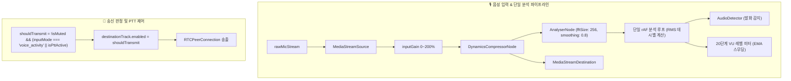

# Phase 9 핵심 설계 해석본 및 용어 사전

> 대상 문서: `Talklite-Phase-9-실행계획.md`  
> 프로젝트: Talklite (온디맨드 게이머 파티 매칭 & 오픈 보이스 플랫폼)  
> 최종 갱신일: 2026-08-28  
> 목적: Phase 9 (고급 음성 UX: 20단계 실시간 VU 레벨 미터, 브라우저 호환 3초 루프백 마이크 테스트, 고신뢰성 푸시 투 톡 PTT 및 전방위 Stuck Mute 방어)의 핵심 설계 배경, 동작 원리, 기술 선택 이유를 쉽게 해설합니다.

---

## 1. Phase 9 핵심 아키텍처 및 설계 원리 해설

### 1) 왜 AudioDetector와 VU 미터가 단일 AnalyserNode를 공유해야 할까요?
* **기존 문제점**: `AudioDetector`(발화 감지)와 VU 레벨 미터(게이지 UI)가 각각 `AudioContext`와 `AnalyserNode`를 별도로 생성하면 브라우저 CPU/메모리 부하가 2배로 증가하고, 브라우저의 동시 AudioContext 제한을 초과할 수 있습니다.
* **해결책**: Phase 8에서 구축한 `VoiceAudioEngine` 내부에 단일 `AnalyserNode`(`fftSize: 256`, `smoothingTimeConstant: 0.8`)를 탑재하고, 하나의 `requestAnimationFrame` 분석 루프에서 **발화 상태 감지와 VU 레벨(EMA Attack 50ms/Release 300ms)을 동시에 계산**하여 렌더링 성능을 극대화합니다.

### 2) VU 미터 게이지가 60fps로 움직일 때 React가 느려지지 않는 비결
* **문제**: 매 프레임(초당 60회)마다 `useState`나 Zustand 상태를 갱신하면 React 컴포넌트 트리가 초당 60회 리렌더링되어 UI 버벅임이 발생합니다.
* **해결책**:
  * VU 레벨 측정값은 20fps Throttle 또는 CSS 변수(`--vu-level`) / Canvas 직접 갱신 방식을 사용하여 **React 리렌더링 폭증을 원천 방어**하면서도 부드러운 20단계 게이지 시각화를 제공합니다.

### 3) 3초 사전 루프백 테스트와 브라우저별 코덱 호환성
* **기능**: 사용자가 마이크 테스트 버튼을 누르면 3초간 음성을 녹음한 후 스피커로 즉시 재생하여 내 목소리의 볼륨과 음질을 100% 사전에 점검합니다.
* **브라우저 호환 코덱 자동 선택**:
  1. `audio/webm;codecs=opus` (Chrome, Firefox, Edge 등 대부분의 브라우저)
  2. `audio/mp4` (Safari macOS/iOS WebKit 환경 필수 폴백)
  3. `audio/ogg` (Firefox 폴백)
* **메모리 누수 방어**: 녹음된 오디오 재생이 끝나거나(`ended`), 에러 발생(`error`), 모달 언마운트 시 **`URL.revokeObjectURL(url)`을 100% 호출**하여 브라우저 메모리 누수를 방지합니다.

### 4) 푸시 투 톡 (Push-to-Talk / PTT)과 단일 송신 판정식 (`shouldTransmit`)
* **동작 원리**: 사용자가 PTT 모드를 선택하면 평소에는 마이크가 무음 상태이다가, 지정된 키(예: `T` 키, `Space`)를 누르고 있을 때만 목소리가 전송됩니다.
* **단일 송신 판정식**:
  $$\text{shouldTransmit} = \neg \text{isMuted} \land (\text{inputMode} == \text{'voice\_activity'} \lor \text{isPttActive})$$
  WebRTC P2P 연결 재협상 없이, WebRTC 송출 트랙인 **`destinationTrack.enabled = shouldTransmit`**만 즉각 조작하므로 지연 없이 완벽한 무음/송신 전환이 일어납니다.

### 5) Alt-Tab 창 전환 시 마이크가 계속 켜져 있는 사생활 노출 방어 (전방위 Stuck 방어)
* **문제**: 사용자가 PTT 키(`T`)를 누른 상태에서 `Alt+Tab`이나 `Cmd+Tab`으로 게임 또는 다른 창으로 넘어가면 브라우저가 `keyup` 이벤트를 수신하지 못해 **마이크가 영원히 켜진 채로 남는 치명적인 보안 사고**가 발생합니다.
* **해결책 (4중 Stuck 가드)**:
  * `window.blur` (창 포커스 상실)
  * `document.visibilitychange` (화면 숨김/최소화)
  * `window.pagehide` (페이지 이탈)
  * `window.contextmenu` (우클릭 메뉴 오픈)
  * 위 이벤트 중 하나라도 발생하면 즉시 **`isPttActive = false`로 강제 전환하고 대기 중인 릴리즈 타이머를 취소**하여 마이크를 즉각 닫아버립니다.

### 6) 채팅 타이핑 중 마이크 오작동 방지 (타이핑 포커스 가드)
* **문제**: PTT 단축키가 `T` 키일 때, 채팅창에 "안녕하세요"나 "Talklite"를 타이핑하면 글자를 칠 때마다 마이크가 켜졌다 꺼지는 문제가 생깁니다.
* **해결책**: 이벤트 타겟이 `input`, `textarea`, `[contenteditable]` 내부이거나, 한글 IME 조합 중(`isComposing === true`)일 때는 PTT 키 입력을 완전히 무시합니다.

---

## 2. Phase 9 핵심 기술 용어 사전

| 용어 | 쉬운 설명 | Talklite에서의 역할 및 구현 상세 |
| :--- | :--- | :--- |
| **VU 레벨 미터 (VU Meter)** | 마이크 입력 세기를 실시간 게이지로 시각화하는 도구 | `-60dB ~ 0dB` 범위를 초록/노랑/빨강 20단계 바로 표시하여 적정 마이크 볼륨 시각화. |
| **EMA 스무딩 (Exponential Moving Average)** | 레벨 게이지가 정신없이 깜빡이지 않고 부드럽게 감쇠하도록 하는 필터 | Attack `50ms`(즉각 상승) / Release `300ms`(부드러운 하강) 지수 감쇠로 시각적 안정성 제공. |
| **루프백 테스트 (Loopback Test)** | 내 마이크 소리를 3초간 녹음하여 내 스피커로 재생해보는 기능 | `MediaRecorder` 다중 코덱(`webm`/`mp4`/`ogg`)으로 3초 녹음 후 `createObjectURL` 청음 및 `revoke` 정리. |
| **푸시 투 톡 (Push-to-Talk / PTT)** | 단축키를 누르고 있는 동안에만 목소리를 전송하는 제어 방식 | `event.code` 기반 키 바인딩, `destinationTrack.enabled` 즉각 제어로 주변 생활 소음 완벽 차단. |
| **Stuck Mute 방어** | 창 전환(Alt-Tab) 시 키 뗌이 누락되어 마이크가 계속 열리는 사고 방어 | `blur`, `visibilitychange`, `pagehide`, `contextmenu` 감지 시 즉시 PTT 강제 해제 및 무음화. |
| **릴리즈 딜레이 (Release Delay)** | PTT 키를 뗀 후 약 200ms 동안 마이크를 유지한 뒤 닫아주는 완충 시간 | 말을 마치기 직전 키를 뗐을 때 문장 끝부분 단어가 잘리는 현상(Truncation)을 방어. |
| **타이핑 포커스 가드** | 텍스트 입력 중 PTT 단축키가 눌려도 마이크가 오작동하지 않게 막는 가드 | `input`, `textarea`, `isComposing` 활성 시 PTT 이벤트 무시. |