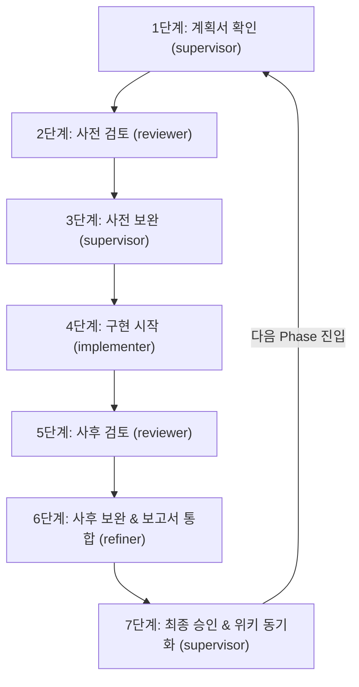

# 📋 Talklite 멀티 에이전트 마일스톤 개발 업무 지침서 (SOP)

> **문서 목적**: 프로젝트 개발을 위한 4개 Herdr Pane 기반 멀티 에이전트의 역할 분담, 산출물 생성 경로, 표준 7단계 반복 프로세스를 규정합니다.  
> **적용 환경**: Herdr CLI 기반 멀티 에이전트 환경 (HERDR_ENV=1)  
> **최초 작성일**: 2026-08-28 (2026-09-03 위키 4대 카테고리 경로 표준화 및 사후검토-보완 통합 규칙 반영)  
> **지침서 위치**: `project/Talklite/docs/멀티-에이전트-마일스톤-개발-업무지침서.md` (SSOT)  
> **위키 지식 저장소**: `C:\Users\kimmh\VibeCoding\LLM-Wiki\AI-Sessions\wiki\projects\Talklite\`

> [!IMPORTANT]
> **⚠️ 위키 문서 작업 시 필수 준수 규약**:  
> 본 프로젝트의 위키(`LLM-Wiki`) 산출물 작업(계획서, 핵심설계, 검토보고서, 완료보고서 작성 및 인덱스/로그 갱신 등)을 진행할 때는 반드시 **[`C:\Users\kimmh\VibeCoding\LLM-Wiki\AGENTS.md`](file:///C:/Users/kimmh/VibeCoding/LLM-Wiki/AGENTS.md)** 문서를 사전에 정독하고 그에 정의된 볼트 운영 규약(카테고리, 네이밍, 한영 하이브리드, 로그 및 인덱스 갱신 등)을 철저히 준수해야 합니다.

---

## 🗂️ 0. 산출물 저장소 및 위키 4대 카테고리 경로 표준

본 프로젝트의 모든 마일스톤 산출물(계획, 설계, 검토, 완료보고서)은 프로젝트 내부 임시 파일이 아닌 **위키(`LLM-Wiki`)의 전용 하위 분류 폴더에 직접 생성 및 영구 보존**됩니다.  
프로젝트 루트의 `docs/` 폴더는 상시 참조용 **업무지침서**와 **인수인계서** 단 2개만 단일하게 유지합니다.

```
📁 C:\Users\kimmh\VibeCoding\LLM-Wiki\AI-Sessions\wiki\projects\Talklite\
├── 📄 log.md                                                      # 프로젝트 작업 이력 로그
├── 📄 마스터-Talklite.md                                          # 프로젝트 마스터 대시보드
│
├── 📁 plans/                                                      # [1] 기획 및 마일스톤 실행 계획서
│   ├── Talklite-요구사항-명세서.md
│   ├── Talklite-개발-계획서.md
│   └── Talklite-Phase-X-실행계획.md                              # (Step 1/3 주관: supervisor)
│
├── 📁 designs/                                                    # [2] 페이즈별 핵심설계 해석본
│   └── Talklite-Phase-X-핵심설계-해석본.md                        # (Step 1/3 주관: supervisor)
│
├── 📁 reviews/                                                    # [3] 사전/사후 검토 및 보완 통합 보고서
│   ├── Talklite-Phase-X-사전검토보고서.md                         # (Step 2 주관: reviewer)
│   └── Talklite-Phase-X-사후검토-및-문제해결-보고서.md             # (Step 5 reviewer 결함 분석 ➔ Step 6 refiner 조치 덧붙임)
│
└── 📁 reports/                                                    # [4] 마일스톤 최종 완료 보고서
    └── Talklite-Phase-X-완료보고서.md                             # (Step 7 주관: supervisor)
```

---

## 👥 1. 4-Pane 에이전트 전담 역할 정의

| Pane Label (식별 라벨) | Pane ID (참조) | Agent Kind | 적용 모델 (Designated Model) | 담당 역할 | 핵심 책무 및 위키 산출물 (Core Responsibilities & Artifacts) |
| :--- | :---: | :---: | :---: | :---: | :--- |
| **`supervisor`** | `w1K:p1` | `agy` | — | **👑 총괄 감독<br>(Supervisor)** | • 전체 마일스톤 개발 라이프사이클 조율 및 단계별 품질 게이트 최종 승인<br>• `implementer`, `reviewer`, `refiner`에게 명확한 태스크 지시 및 의사결정<br>• **위키 계획/설계 수립**: `plans/Talklite-Phase-X-실행계획.md`, `designs/Talklite-Phase-X-핵심설계-해석본.md`<br>• **위키 완료 보고서 작성**: `reports/Talklite-Phase-X-완료보고서.md`<br>• 백엔드 전체 회귀 테스트(52+ ALL PASS) 및 프론트 빌드/린트 무결성 최종 검증<br>• 위키, 인수인계서, CodeGraph, QMD 로컬 동기화 및 Git 로컬 커밋 총괄 (원격 푸시는 사용자 명시적 승인 후 수행) |
| **`implementer`** | `w1K:p2` | `opencode` | **camelStream Auto**<br>(Provider: `camelStream`) | **🛠️ 메인 구현<br>(Implementer)** | • 위키 실행 계획서(`plans/`) 및 핵심설계 해석본(`designs/`)에 기반한 코어 코드(백/프론트) 본 구현<br>• 핵심 클래스/컴포넌트/스토어 신설 및 1차 기능 완결<br>• 단위 린트 및 빌드 검증 (`npm run lint`, `npm run build`, `mvn test-compile`) 1차 완료 후 핸드오프 |
| **`reviewer`** | `w1K:p3` | `opencode` | **Muse Spark 1.3 Contributor**<br>(Provider: `OpenCode Go`) | **🔍 코드 검토<br>(Reviewer)** | • **[검토 전담] 직접 코드를 수정하지 않고 오직 정밀 검토/분석 및 위키 보고서 작성만 수행**<br>• 사전 설계 검토 보고서 작성: **`reviews/Talklite-Phase-X-사전검토보고서.md`**<br>• 사후 diff 분석 및 결함(P0/P1/P2) 진단 보고서 작성: **`reviews/Talklite-Phase-X-사후검토-및-문제해결-보고서.md`**<br>• 리소스 수명주기 관리 및 메모리 누수 방어 여부 검토 (Node disconnect, Event listener 해제 등)<br>• 에러 핸들링, 비정상 단절 처리, 접근성(a11y), 엣지 케이스 도출 및 구체적 Action Items 작성 |
| **`refiner`** | `w1K:p4` | `opencode` | **Muse Spark 1.3 Contributor**<br>(Provider: `OpenCode Go`) | **✨ 보완 작업<br>(Refiner)** | • **[보완 전담] `reviewer`가 작성한 위키 검토 보고서(`reviews/Talklite-Phase-X-사후검토-및-문제해결-보고서.md`)를 직접 정독하고 실제 코드 수정 및 보완 작업 전담 수행**<br>• **별도의 보완보고서를 생성하지 않고, 위키 `reviews/Talklite-Phase-X-사후검토-및-문제해결-보고서.md` 하단에 `## 🛠️ 리파이너 보완 조치 및 최종 반영 내역` 섹션으로 실제 조치 내역과 빌드/린트 결과를 누적 덧붙임(Append-Only)**<br>• 브라우저 호환성 및 엣지 케이스 방어 가드 코드 적용<br>• 린트 0 error 및 빌드 무결성 유지 상태로 감독(`supervisor`)에게 인계 |

---

## 🔄 2. 마일스톤 표준 7단계 개발 사이클 (Standard Lifecycle)

모든 마일스톤은 아래 **7단계 순환 프로세스**를 엄격히 준수하여 순차적으로 진행합니다.



---

### 📌 Step 1: 계획서 확인 (Plan Verification)
* **주관**: `supervisor` (총괄 감독, `w1K:p1`)
* **수행 내용**:
  1. 위키 내 해당 Phase 실행 계획서 (**`plans/Talklite-Phase-X-실행계획.md`**) 및 핵심설계 해석본 (**`designs/Talklite-Phase-X-핵심설계-해석본.md`**) 정독 및 작성
  2. 선행 마일스톤과의 의존성 및 백엔드/프론트엔드 변경 영향도 파악
  3. 완료 정의(DoD) 및 테스트 요구사항 목록 확정

### 📌 Step 2: 사전 설계 검토 (Pre-Implementation Review)
* **주관**: `reviewer` (`w1K:p3`)  *(※ 리뷰어는 검토만 전담)*
* **수행 내용**:
  1. `supervisor`가 `reviewer`에게 위키 실행 계획서 및 핵심설계 해석본에 대한 사전 설계 검토 요청
  2. 아키텍처 결함, 브라우저 API 제약사항, WebRTC/STOMP 충돌 가능성, 성능 병목 사전 도출
  3. 위키 **`reviews/Talklite-Phase-X-사전검토보고서.md`** 파일로 상세 분석 보고서 직접 작성 및 저장 (코드 수정 일체 금지)

### 📌 Step 3: 사전 보완 (Pre-Implementation Refinement)
* **주관**: `supervisor` (총괄 감독, `w1K:p1`)
* **수행 내용**:
  1. 작성된 위키 사전검토보고서(`reviews/Talklite-Phase-X-사전검토보고서.md`) 피드백을 수렴하여 위키 실행 계획서(`plans/`) 및 핵심설계 해석본(`designs/`)에 반영 최신화
  2. `implementer`가 구현 시 지켜야 할 명확한 기술 스펙 및 규칙 확정

### 📌 Step 4: 구현 시작 (Main Implementation)
* **주관**: `implementer` (메인 구현, `w1K:p2`)
* **수행 내용**:
  1. `supervisor`의 작업 지시에 따라 코어 비즈니스 로직, API, 컴포넌트, 상태 스토어 구현
  2. 로컬 린트 및 빌드 검증 수행 (`npm run lint`, `npm run build`, `mvn test-compile`)
  3. 변경 사항 목록 및 1차 구현 완료 보고서를 작성하여 `supervisor`에게 전달

### 📌 Step 5: 사후 검토 (Post-Implementation Review)
* **주관**: `reviewer` (코드 검토, `w1K:p3`)  *(※ 리뷰어는 검토만 전담)*
* **수행 내용**:
  1. `git diff`를 정밀 분석하여 코드 품질, 잠재적 버그, 리소스 해제 누락, UI 접근성 점검 (코드 수정 금지)
  2. 수정이 필요한 구체적인 항목(P0/P1/P2 Action Items)과 파일 위치, 라인 번호, 개선 가이드를 위키 **`reviews/Talklite-Phase-X-사후검토-및-문제해결-보고서.md`** 파일로 직접 작성하여 저장
  3. **⚠️ [누적 기록(Append-Only) 원칙]**: 추가 이슈나 재검토가 발생할 때 **절대로 기존 보고서 내용을 덮어쓰지 않고, `## [Round 1] 1차 사후 검토`, `## [Round 2] 2차 긴급 검토` 등 하단에 누적(Append)하여 이전 발견 내역과 히스토리를 100% 영구 보존**합니다.

### 📌 Step 6: 사후 보완 & 보고서 통합 (Post-Implementation Polish & Merge)
* **주관**: `refiner` (보완 작업, `w1K:p4`)  *(※ 리파이너는 보완 코드 작성 전담)*
* **수행 내용**:
  1. `supervisor`로부터 검토 보고서 파일 경로를 전달받아, 위키 **`reviews/Talklite-Phase-X-사후검토-및-문제해결-보고서.md` 문서를 직접 열람 및 정독**
  2. 보고서에 기술된 Action Items(P0/P1/P2)를 빠짐없이 실제 소스코드에 반영 (리팩토링, 엣지 케이스 가드 적용, 디바운스/핫스왑 최적화)
  3. **⚠️ [단일 통합 보고서 작성 규약]**: **별도의 보완보고서 파일을 생성하지 않고, 위키 `reviews/Talklite-Phase-X-사후검토-및-문제해결-보고서.md` 하단에 `## 🛠️ 리파이너 보완 조치 및 최종 반영 내역` 섹션으로 실제 코드 수정 내역과 린트/빌드 결과를 덧붙여(Append-Only) 단일 통합 문서로 완성**합니다.
  4. 프론트엔드 린트 0 error 및 빌드 통과 재확인 후 `supervisor`에게 최종 인계

### 📌 Step 7: 최종 승인 및 다음 마일스톤 (Final Approval & Handoff)
* **주관**: `supervisor` (총괄 감독, `w1K:p1`)
* **수행 내용**:
  1. **품질 게이트 검증**:
     * 프론트엔드: `cd frontend; npm run lint && npm run build` (0 error)
     * 백엔드: `cd backend; .\mvnw.cmd test` (전체 회귀 테스트 ALL PASS)
  2. **위키 마일스톤 완료 보고서 작성**:
     * 위키 **`reports/Talklite-Phase-X-완료보고서.md` 작성**: 마일스톤 목표 및 달성 요약, 주요 구현 내용(Web Audio, API, UI 등), 품질 검증 결과 표(린트/빌드/테스트/DoD)를 간략하고 명확하게 작성
  3. **지식 베이스 및 문서 동기화**:
     * 프로젝트 루트 `docs/인수인계서.md` 체크리스트 및 상태 갱신
     * 위키 실행 계획서(`plans/Talklite-Phase-X-실행계획.md`) `status: completed` 🔵 전환
     * 위키 `log.md` 및 `마스터-Talklite.md` 최신 링크/상태 동기화
     * `codegraph sync` 및 `qmd update; qmd embed` 지식 인덱싱
  4. **버전 관리**: Git 로컬 커밋 (`git commit`) 완료 (⚠️ **GitHub 원격 저장소 푸시(`git push`)는 절대로 자동 수행하지 않음** — 최종 완료 보고 후 사용자의 명시적 승인을 받아서 수행하거나 사용자가 직접 수행함)
  5. **다음 마일스톤 지시**: 사용자 보고 후 다음 Phase의 **Step 1**으로 즉시 진입

---

## 🖥️ 3. 세션 무관 4-Pane 작업 환경 유지 지침 (Herdr Environment Rule)

어떤 세션이나 재시작 상황에서도 **항상 동일하고 일관된 멀티 에이전트 작업 환경을 보장**하기 위해 다음 규정을 준수해야 합니다.

1. **상시 4-Pane 역할별 라벨 및 지정 모델 유지 의무**:
   * Herdr 터미널 멀티플렉서 환경(`HERDR_ENV=1`)에서 항상 **4개의 독립된 역할 라벨 Pane**과 **규정된 지정 모델**이 활성화되어 있어야 합니다.
   * `w1K:p1` (라벨: **`supervisor`**): 총괄 감독 (`agy`)
   * `w1K:p2` (라벨: **`implementer`**): 메인 구현 (`opencode` / **`camelStream Auto`**)
   * `w1K:p3` (라벨: **`reviewer`**): 코드 검토 (`opencode` / **`Muse Spark 1.3 Contributor`**)
   * `w1K:p4` (라벨: **`refiner`**): 보완 작업 (`opencode` / **`Muse Spark 1.3 Contributor`**)
2. **세션 시작 시 상태 검증 & 자동 라벨링**:
   * 새로운 세션이 열리거나 에이전트가 재부팅되면, 감독(`supervisor`)은 가장 먼저 `herdr pane list` 및 `herdr agent list`를 호출하여 4개 Pane의 라벨과 에이전트 상태를 검증합니다.
   * 라벨이 유실되었거나 재설정이 필요한 경우 즉시 아래 명령으로 복구합니다:
     ```bash
     herdr pane rename w1K:p1 supervisor
     herdr pane rename w1K:p2 implementer
     herdr pane rename w1K:p3 reviewer
     herdr pane rename w1K:p4 refiner
     ```
3. **에이전트 미기동 시 지정 모델 포함 원샷 기동 명령 (Agent Start with Model)**:
   * `herdr agent start`에 `-- -m <provider/model>` 옵션을 결합하여 실행과 동시에 규정된 모델을 즉시 적용합니다:
     ```bash
     # implementer (w1K:p2) -> camelStream Auto
     herdr agent start implementer --kind opencode --pane w1K:p2 -- -m camel-stream/auto

      # reviewer (w1K:p3) -> Muse Spark Contributor (OpenCode Go)
      herdr agent start reviewer --kind opencode --pane w1K:p3 -- -m opencode-go/muse-spark-1.3-contributor

      # refiner (w1K:p4) -> Muse Spark Contributor (OpenCode Go)
      herdr agent start refiner --kind opencode --pane w1K:p4 -- -m opencode-go/muse-spark-1.3-contributor
     ```
4. **모델 적용 및 화면 상태 최종 검증**:
   * 각 Pane의 뷰포트를 읽어 올바른 모델이 노출되는지 확인합니다:
     ```bash
     herdr pane read w1K:p2 --source visible
     herdr pane read w1K:p3 --source visible
     herdr pane read w1K:p4 --source visible
     ```

---

## 🛠️ 4. Herdr 협업 운영 명령어 가이드

감독(`supervisor`)은 다음의 Herdr CLI 명령어를 통해 각 에이전트와 통신하고 동기화를 제어합니다.

```bash
# 1. 4-Pane 에이전트 연결 상태 점검
herdr agent list
herdr pane list

# 2. 특정 역할 Pane에 태스크 지시 및 완료 대기 (--wait)
herdr agent prompt w1K:p2 "<implementer 작업 지시>" --wait --timeout 300000
herdr agent prompt w1K:p3 "<reviewer 검토 지시>" --wait --timeout 120000
herdr agent prompt w1K:p4 "<refiner 보완 지시>" --wait --timeout 120000

# 3. 에이전트의 작업 결과 및 보고서 읽기
herdr agent read <pane_id> --source recent-unwrapped --lines 200

# 4. 백그라운드 작업 완료 대기
herdr agent wait <pane_id> --timeout 120000
```

---

## 💡 5. 사용자 제기 결함/문제점(User Feedback) 처리 규칙

에이전트의 자체 자동 분석이 아닌, **사용자(인간 개발자)가 실전 테스트 등을 통해 직접 발견하여 제기한 문제점**에 대해 분석, 보완 기획, 보완 작업을 수행할 때는 다음 규칙을 엄격히 적용합니다:

1. **기존 기능 범위 내 결함 및 버그 수정**:
   - 가장 최근에 완료/진행 중인 페이즈의 위키 사후 검토 보고서(`reviews/Talklite-Phase-X-사후검토-및-문제해결-보고서.md`)에 `## [Round X] 사용자 제기 결함 분석 및 조치` 형태로 **내용을 하단에 누적 추가(Append-Only, 덮어쓰기 절대 금지)**하여 분석과 보완 내역을 영구 보존합니다.
2. **기능 확장 및 신규 파이프라인 도입인 경우**:
   - 단순 버그 수정이 아니라 해당 문제점 해결을 위해 **새로운 기능/도메인이 도입되거나 파이프라인이 확장되는 경우**(예: 독립 출력 장치 선택 파이프라인 도입 등)에는 기존 페이즈에 덧붙이지 않고 **별도의 독립 마일스톤(Phase X+1)으로 분리하여 정식 7단계 사이클로 수립 및 관리**합니다.
