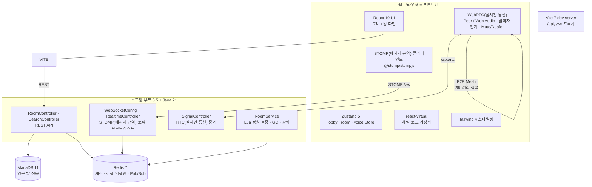
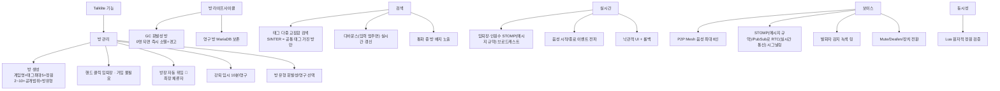
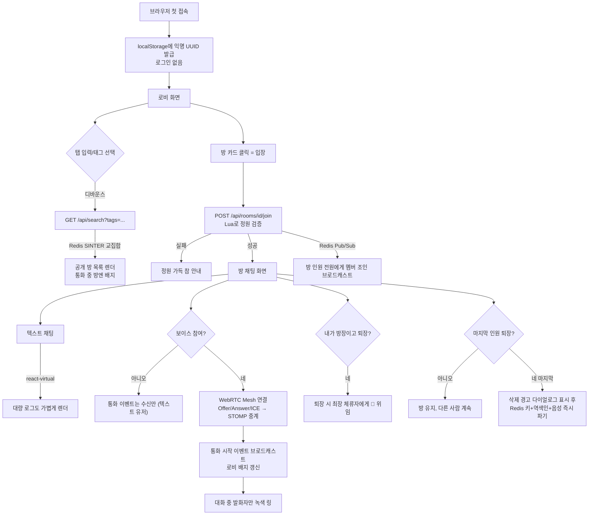
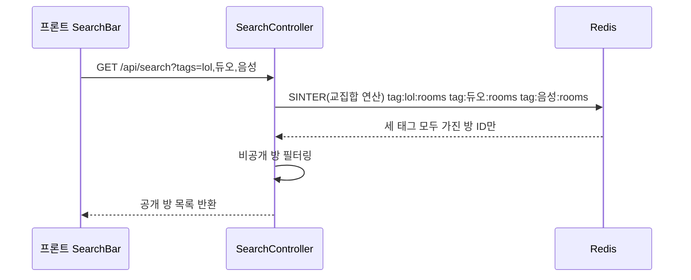
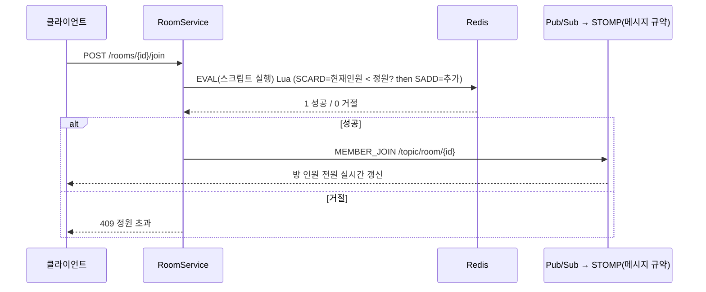
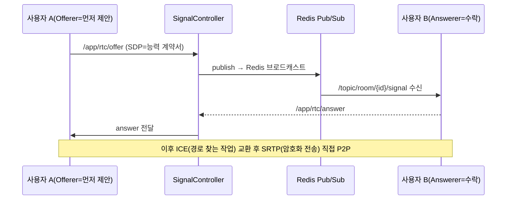
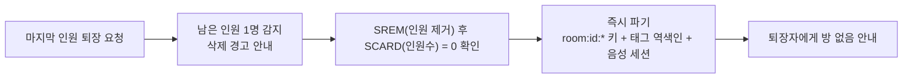

# 🗺️ Talklite 구조도 (이해를 위한 개요)

> Talklite — 온디맨드 게이머 파티 매칭 & 오픈 보이스 플랫폼
> (토크온 + 카카오톡 오픈채팅 + 디스코드 모델, 브랜드명 확정)
>
> 출처: `Talklite-요구사항-명세서(SRS)` · `Talklite-개발-계획서` (LLM-Wiki)

---

## 목차
1. [전체 시스템 구조 (아키텍처)](#1-전체-시스템-구조)
2. [기술 스택별 역할 & 연관 기능](#2-기술-스택별-역할--연관-기능)
3. [포함된 기능 구성도](#3-포함된-기능-구성도)
4. [시스템 동작 흐름 — 사용자 시나리오](#4-시스템-동작-흐름)
5. [핵심 데이터 흐름 (빠른 동작 원리)](#5-핵심-데이터-흐름)
6. [축약어 사전 (한눈에)](#6-축약어-사전-한눈에)

---

## 1. 전체 시스템 구조

**읽는 법** — 모든 사용자는 브라우저(프론트)에서 접속한다. `Vite dev server`가 REST/WebSocket 요청을 백엔드로 프록시(중계)하고, 실시간/보이스는 STOMP·WebRTC로 돌아간다. **상태의 원본은 Redis**, 영구 방(0명이어도 보존)만 MariaDB에 남는다.

**축약어 풀이** — **RTC**(Real-Time Communication, 실시간 통신) · **STOMP**(웹 통로 위에서 텍스트 메시지를 주고받는 규약) · **ICE**(직접 통화가 가능한 네트워크 경로를 찾는 작업) · **SDP**(통화 시작 전 "어떤 코덱/능력 쓸지" 주고받는 계약서) · **TTL**(Time To Live, 지나면 자동 삭제되는 유지 시간) · **SINTER**(Set INTERsection, 집합들의 교집합 구하는 연산) · **SRTP**(Secure RTP, 음성 데이터를 암호화해 보내는 전송 방식)

---

## 2. 기술 스택별 역할 & 연관 기능

| # | 기술 | 하는 일 | 어떤 기능과 연결되는가 |
| :-- | :--- | :--- | :--- |
| 1 | **React 19 + TypeScript 5** | 컴포넌트 UI + 타입 안정성 | 전체 화면(로비·방·보이스 바) |
| 2 | **Vite 7** | 개발 서버 + 번들, dev 프록시(`/api`,`/ws`) | 프론트 부팅, 백엔드 호출 경유 |
| 3 | **Zustand 5** | 전역 상태 관리, **낙관적 UI + 실패 롤백** | 실시간 입퇴장 즉시 반영 (FR-RT-03) |
| 4 | **Tailwind 4** | 스타일링 | 로비 카드, 통화 뱃지, 발화자 녹색 링 |
| 5 | **@tanstack/react-virtual** | 대량 채팅 목록 가상화 렌더 | 채팅 로그 성능 (NFR-PERF-01/03) |
| 6 | **@stomp/stompjs** | STOMP 메시지 송수신 | 방 토픽 실시간, RTC 시그널링 경로 (FR-RT, FR-VOICE-02) |
| 7 | **WebRTC / Web Audio** (브라우저 내장) | P2P 음성(Mesh ≤6인) + `AnalyserNode` 발화 감지 + Mute/Deafen | FR-VOICE-01/03/04 |
| 8 | **Spring Boot 3.5 + Java 21** | REST · WebSocket(STOMP) · 방 라이프사이클 | 방 관리·실시간·강퇴·GC 전반 |
| 9 | **spring-data-redis + Lettuce** | Redis 연동 (standalone 단일 노드) | 세션 카운팅, 정원 검증 (NFR-SCALE-02) |
| 10 | **Redis 7 — Set + SINTER** | `tag:{name}:rooms` 역색인 **교집합 검색** | 마이크로초 검색 (FR-SEARCH-01/02, NFR-PERF-02) |
| 11 | **Redis 7 — Lua Script** | **원자적 정원 검증** (경쟁 상태 방지) | 동시 입장 안전 (FR-CONC-01/02, NFR-CONS-01) |
| 12 | **Redis 7 — Pub/Sub + Key Expiration** | 이벤트 전파 / 임시 자료 TTL | 실시간 브로드캐스트, 임시 강퇴 10분, 초대코드 |
| 13 | **Redis — Room GC** | 마지막 인원 퇴장 시 즉시 소멸 | 휘발성 방 자동 삭제 (FR-ROOM-02, NFR-CONS-02) |
| 14 | **MariaDB 11** | **영구 방**만 보존·복원 | 북마크/고유코드 재입장 (FR-ROOM-03) — **Phase 6까지 보류** |

> 💡 **핵심**: Redis 하나가 "세션 + 검색엔진 + 메시지 버스 + 스케줄러(GC)"를 모두 담당. MariaDB는 영구 방 저장용 보조 역할에 불과(Phase 6까지 미사용).

---

## 3. 포함된 기능 구성도

---

## 4. 시스템 동작 흐름

사용자가 Talklite를 사용하는 한바퀴 시나리오.

---

## 5. 핵심 데이터 흐름

### 5.1 검색 (핵심 성능 포인트)

### 5.2 입장 (Lua 원자적 정원 검증)

### 5.3 보이스 시그널링 (STOMP 중계 — 미디어는 P2P 직결)

### 5.4 Room GC (휘발성 방 소멸)

---

## 6. 축약어 사전 (한눈에)

> 아래 **7개 축약어**만 미리 알아두면 도표의 메시지 규약·실시간 통신 부분이 읽힙니다.

| 축약어 | 풀어쓰기 | 뜻 |
| :--- | :--- | :--- |
| **RTC** | Real-Time Communication | 실시간 통신 (여기선 WebRTC = 웹 실시간 통신) |
| **STOMP** | Simple Text Oriented Messaging Protocol | 웹 통로 위에서 텍스트 메시지를 "누구에게(토픽)" 보낼지 정하는 규칙 |
| **SDP** | Session Description Protocol | 통화 시작 전 주고받는 "어떤 코덱·기능 쓸 수 있는지" 능력 계약서 |
| **ICE** | Interactive Connectivity Establishment | 서로 통할 수 있는 네트워크 경로를 찾는 작업 |
| **TTL** | Time To Live | 지나면 자동 삭제되는 유지 시간 (예: 임시 강퇴 10분) |
| **SINTER** | SET INTERsection | 여러 집합의 **공통 부분(교집합)** 을 구하는 연산 → "태그 동시에 가진 방" 찾기 |
| **SRTP** | Secure Real-time Transport Protocol | 실제 음성 데이터를 암호화해 전송 (도청 방지) |

---

## 💡 한눈에 보는 요약

- **만드는 것**: 로그인 없이 게임명/해시태그로 즉석 파티를 찾고, 텍스트 채팅 + 선택적 그룹 음성 통화하는 웹 서비스.
- **특징**: 방이 "있을 때만" 데이터가 있는 가벼운 구조 (휘발성), 유지 원하면 영구 방(MariaDB).
- **기술 자랑 포인트**: Redis SINTER 검색 · Lua 원자적 정원 검증 · STOMP 중계 WebRTC Mesh · Room GC.
- **현재 단계**: Phase 0(환경 셋업) 계획 확정 상태, 실제 코드는 아직 미구현.
